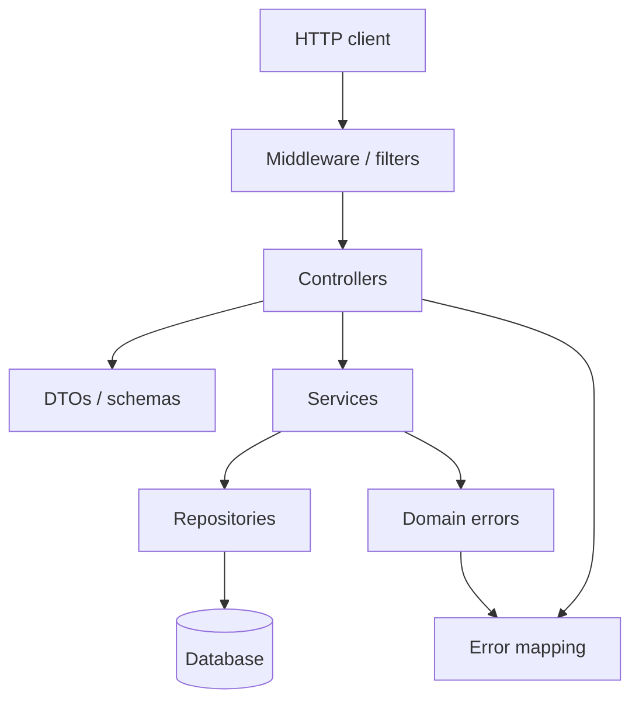

REST package layout
How the **templates domains** fit together in a typical REST backend. Controllers stay thin; everything else supports them.

## Layers



| Layer | Template domain | Job |
|-------|-----------------|-----|
| Edge | [Middleware](middleware/i-overview.md) | Auth, logging, CORS, request IDs |
| HTTP | [Controllers](controllers/i-overview.md) | Routes, status codes |
| Wire shapes | [DTOs](dtos/i-overview.md) | Request/response JSON + validation (**not** DAOs) |
| Use-cases | [Services](services/i-overview.md) | Business rules |
| Persistence | [Repositories](repositories/i-overview.md) | Load/save aggregates (DAO role) |
| Failures | [Errors](errors/i-overview.md) | Typed errors → HTTP mapping |

## Suggested package folders

```text
api/ or web/
  controllers/     # or handlers/
  dto/             # or schemas/
  middleware/
application/ or service/
  ItemService...
domain/ or model/
  Item, errors...
infrastructure/ or repository/
  ItemRepository...
```

Names vary by team (hexagonal, clean architecture, “just packages”). The **dependencies** matter more than folder labels: controllers depend inward; repositories sit at the edge of persistence.

## Same resource, all layers

The templates reuse one resource — **Item** (`id`, `name`) — so you can copy a vertical slice across languages.

## Next

[DTOs](dtos/i-overview.md) or jump to [Controllers](controllers/i-overview.md).
