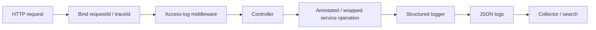

Logging — overview
The most **programmatic** logging design puts policy in reusable infrastructure—not repeated `log.info(...)` calls in every controller. One request wrapper owns request completion logs; one operation wrapper owns service timing and failures; request context automatically supplies correlation fields.

Logging is one signal within [Observability](../observability/i-overview.md). Use this domain when you want concrete, reusable logging code.

## Architecture



| Layer | Log automatically | Do not log |
|-------|-------------------|------------|
| **Request wrapper** | method, route template, status, duration, request/trace IDs | Full body, authorization headers |
| **Operation wrapper** | operation name, outcome, duration, safe identifiers | Raw arguments/results by default |
| **Business code** | Important domain events and decisions | Routine entry/exit noise |
| **Error boundary** | Error type, stack trace, request ID | Same exception at every layer |

## Programmatic pattern

Each stack implements the same four pieces:

1. **Context propagation** — bind `requestId`, `traceId`, actor/tenant IDs once.
2. **Structured logger** — emit fields, not interpolated prose.
3. **Request middleware** — one completion event in `finally` / response-finish.
4. **Operation instrumentation** — annotation, decorator, higher-order function, or generic wrapper.

```text
event=http.request.completed
requestId=...
method=GET
route=/api/items/{id}
status=200
durationMs=12
```

## Stable event schema

Use consistent names across every service:

| Field | Meaning |
|-------|---------|
| `event` | Machine-stable event name, such as `item.created` |
| `requestId`, `traceId` | Correlation across hops |
| `operation` | Stable use-case name, not an implementation detail |
| `outcome` | `success`, `error`, `cancelled`, `rejected` |
| `durationMs` | Numeric latency for search and aggregation |
| `errorType` | Exception/error class—not sensitive error text |
| `itemId`, `actorId` | Allowlisted identifiers only |

Human-readable messages may change; dashboards should query **fields** and stable `event` values.

## Levels

| Level | Use |
|-------|-----|
| `ERROR` | Unexpected failure requiring action; include stack once |
| `WARN` | Degraded/rejected but handled: retry exhausted, 429, stale fallback |
| `INFO` | Request completion and meaningful domain events |
| `DEBUG` | Diagnostic decisions and safe identifiers |
| `TRACE` | Extremely verbose local troubleshooting only |

## Redaction rules

Never log passwords, tokens, cookies, authorization headers, full request/response bodies, payment data, or secrets. Prefer an **allowlist** of safe fields over trying to redact every dangerous field after the fact.

## Language templates

| Note | Programmatic mechanism |
|------|------------------------|
| [Java — Spring](ii-java-spring.md) | `OncePerRequestFilter` + `@LoggedOperation` AOP aspect + MDC |
| [Python — FastAPI](iii-python-fastapi.md) | middleware + `contextvars` + async-aware decorator |
| [JavaScript — Express](iv-javascript-express.md) | Pino child logger + `AsyncLocalStorage` + higher-order wrapper |
| [Go — net/http](v-go-nethttp.md) | `slog` context middleware + generic operation function |

## Production rules

| Rule | Why |
|------|-----|
| **Log once per boundary** | Prevent duplicate exception noise |
| **Never swallow errors** | Log, then rethrow/return so transactions and handlers still work |
| **Lazy/structured fields** | Avoid string construction when a level is disabled |
| **Route templates only** | `/items/{id}`, not `/items/9281`, to control cardinality |
| **One logger configuration** | Format, level, sink, and redaction stay centralized |
| **Sample noisy success logs** | Keep all errors; sample high-volume 2xx events if cost requires |

## Next

Pick your stack, then pair it with [Observability](../observability/i-overview.md) for metrics and traces.
