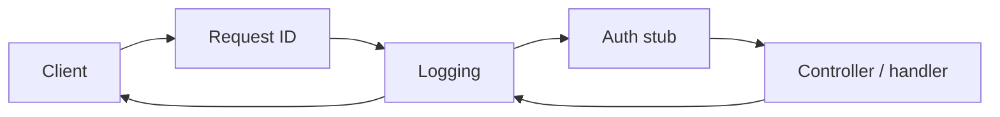

Middleware — overview
**Middleware** (filters, interceptors, wrapper handlers) runs **cross-cutting** logic on every request: assign a **request ID**, **log** method/path/duration, attach a stub **auth** context. Handlers stay thin; behavior is consistent app-wide.

## Mental model

| Concern | Typical placement |
|---------|-------------------|
| **Request ID** | Generate or forward `X-Request-Id`; echo on response |
| **Logging** | Start timer → log status + duration after handler |
| **Auth stub** | Read header / cookie → set `userId` on context (real auth later) |
| **Error passthrough** | Let domain errors bubble to the global error handler |

## Language templates

| Note | Stack |
|------|--------|
| [Java — Spring](ii-java-spring.md) | `OncePerRequestFilter` + `X-Request-Id` |
| [Python — FastAPI](iii-python-fastapi.md) | ASGI middleware or `Depends` |
| [JavaScript — Express](iv-javascript-express.md) | `(req, res, next)` chain |
| [Go — net/http](v-go-nethttp.md) | `func(next http.Handler) http.Handler` |

## Notes

| Topic | Practice |
|-------|----------|
| **Order** | Request ID first; logging wraps the rest; auth before handlers |
| **Propagate ID** | Include request ID in logs and error JSON for support |
| **Fail closed (auth)** | Missing/invalid credentials → 401 from middleware when enforced |
| **Keep stubs obvious** | Comment `// TODO: real JWT` — don't ship hard-coded users |

## Next

Pick your stack — start with [Java — Spring](ii-java-spring.md) or [Python — FastAPI](iii-python-fastapi.md).
