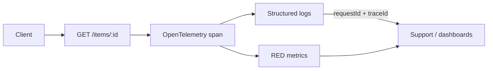

Observability — overview
**Observability** answers *why* a request failed or was slow — not just *that* it failed. The three pillars are **logs** (discrete events), **metrics** (aggregated counters/histograms), and **traces** (request-scoped spans). Tie them together with a **request ID** and optional **trace ID** so you can jump from a spike in latency to the exact log lines.

For reusable logging infrastructure—request context, access middleware, operation wrappers, structured fields, and redaction—use the dedicated [Logging templates](../logging/i-overview.md).

## Mental model

| Pillar | HTTP focus | Item resource example |
|--------|------------|------------------------|
| **Logs** | One line per request + errors with context | `{"requestId":"…","method":"GET","path":"/api/items/42","status":404,"ms":12}` |
| **Metrics** | **RED**: Rate, Errors, Duration per route | `http_server_requests_seconds` for `GET /api/items/{id}` |
| **Traces** | Span per handler; child spans for DB/cache | `GET Item` span → `repository.findById` child |

## RED vs USE (pick one lens)

| Lens | Measures | Good for |
|------|----------|----------|
| **RED** | Requests/sec, error ratio, latency | Request-driven services (REST APIs) |
| **USE** | Utilization, saturation, errors | Infrastructure (CPU, connection pools, queues) |

Start with **RED on HTTP routes** — it maps directly to client experience.

## Correlation rules

| Signal | Carry |
|--------|--------|
| **Request ID** | Generate or forward `X-Request-Id`; echo on response; put in every log line |
| **Trace ID** | OpenTelemetry injects `trace_id` / `span_id` into log MDC when enabled |
| **Structured fields** | JSON or key=value — avoid plain `println` in production |

## Language templates

| Note | Stack |
|------|--------|
| [Java — Spring](ii-java-spring.md) | Micrometer timer + MDC `requestId` |
| [Python — FastAPI](iii-python-fastapi.md) | `structlog` / logging + timing metric stub |
| [JavaScript — Express](iv-javascript-express.md) | Pino-style structured log + duration |
| [Go — net/http](v-go-nethttp.md) | `slog` + middleware duration; OTel note |

## Notes

| Topic | Practice |
|-------|----------|
| **Structured logs** | Same fields across services; see [programmatic Logging](../logging/i-overview.md) |
| **Don't log secrets** | Strip auth headers, tokens, PII before emit |
| **Metrics cardinality** | Label by route template (`/api/items/{id}`), not raw IDs |
| **Trace sampling** | 100% in dev; head-sample in prod (e.g. 1–10%) to control cost |
| **One middleware owns timing** | Start clock before handler; record metric + log in `finally` |

## Next

[Programmatic Logging](../logging/i-overview.md), or start with [Java — Spring](ii-java-spring.md) / [Python — FastAPI](iii-python-fastapi.md).
