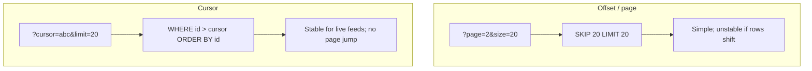

Pagination — overview
**List endpoints must return bounded results.** Never ship unbounded `SELECT *` or `findAll()` to production clients — memory, latency, and abuse risk grow without limit.

Two common strategies: **offset/limit** (page numbers) and **cursor** (opaque bookmark). Pick based on consistency needs and whether you can afford a total count.

## Offset vs cursor



| Strategy | Query params | Pros | Cons |
|----------|--------------|------|------|
| **Offset / page** | `page` + `size` (or `offset` + `limit`) | Easy UI ("page 3 of 10"); familiar | Slow on large offsets; duplicates/skips if data changes mid-scroll |
| **Cursor** | `cursor` + `limit` | Stable for inserts/deletes; efficient on indexed sort key | No arbitrary page jump; cursor encoding is your contract |
| **Keyset** | Same as cursor | Same as cursor | Requires a unique, sortable column (often `id` or `(created_at, id)`) |

## Response envelope

Use a **consistent wrapper** so clients know how to fetch the next chunk:

```json
{
  "items": [{ "id": "1", "name": "Widget" }],
  "nextCursor": "eyJpZCI6IjEifQ",
  "total": 842
}
```

| Field | Required? | Notes |
|-------|-----------|-------|
| `items` | **Yes** | The page of results — cap length server-side |
| `nextCursor` | For cursor style | `null` or omit when no more pages |
| `total` | Optional | Full count — often expensive (`COUNT(*)`); skip for infinite feeds |

**Offset style** may use `page`, `size`, `total`, and `hasNext` instead of `nextCursor`. Pick one envelope per API and document defaults (e.g. `size` default 20, max 100).

## Total count tradeoffs

| Include `total`? | When |
|------------------|------|
| **Yes** | Admin tables, small datasets, search UIs that show "842 results" |
| **No** | High-traffic feeds, huge tables, or when `COUNT(*)` blocks the list query |
| **Approximate** | Analytics dashboards — document that the number is estimated |

Enforce **max page size** in validation — reject `size=999999` with `400`.

## Shared resource (Item)

```text
GET /api/items?page=1&size=20
GET /api/items?cursor=abc&limit=20

Item { id, name }
PagedResponse { items: Item[], nextCursor?, total? }
```

Wire through [Controllers](../controllers/i-overview.md) → [Services](../services/i-overview.md) → [Repositories](../repositories/i-overview.md). Repositories should accept `(offset, limit)` or `(cursor, limit)` — not return unbounded lists.

## Language templates

| Note | Stack |
|------|--------|
| [Java — Spring](ii-java-spring.md) | `@RequestParam` + page DTO |
| [Python — FastAPI](iii-python-fastapi.md) | Query models + Pydantic envelope |
| [JavaScript — Express](iv-javascript-express.md) | Query parse + response shape |
| [Go — net/http](v-go-nethttp.md) | Query helpers + JSON envelope |

## Notes

| Topic | Practice |
|-------|----------|
| **Default + max limit** | e.g. default 20, max 100 — always clamp server-side |
| **Sort key** | Cursor pagination needs a deterministic `ORDER BY` |
| **Empty page** | Return `{ "items": [], "nextCursor": null }`, not 404 |
| **Prod rule** | No unbounded list endpoints — paginate or stream |

## Next

Pick your stack — start with [Java — Spring](ii-java-spring.md) or [Python — FastAPI](iii-python-fastapi.md).
