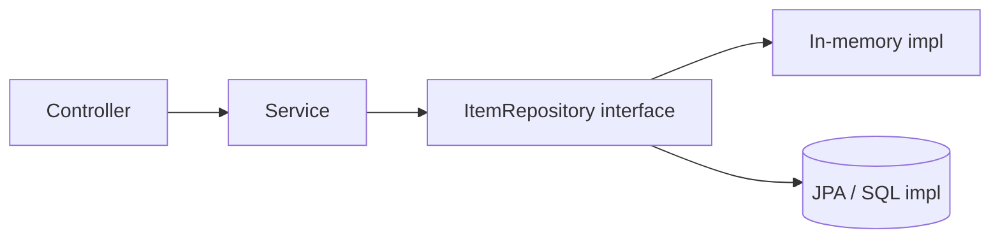

Repositories — overview
A **repository** is the persistence boundary: load and save domain objects without leaking SQL, drivers, or ORM details into controllers or services. Define an **interface** (or protocol) your app depends on; swap **implementations** (in-memory for tests, JPA/Postgres for production).

Same idea as a classic **DAO** (Data Access Object) — methods that talk to storage. That is **not** a **DTO** (Data Transfer Object), which is only a wire/API shape. See [DTO vs DAO](../dtos/i-overview.md#dto-vs-dao-do-not-mix-these-up).

## Mental model



| Responsibility | Belongs in repository? |
|----------------|------------------------|
| CRUD for one aggregate | Yes |
| Query by id / list all | Yes |
| HTTP status codes | **No** — controller / error layer |
| Business rules | **No** — service layer |
| DTO mapping (optional) | Sometimes at the edge |

## Item resource (shared shape)

```text
Item { id, name }
  findAll() → list
  findById(id) → Item | not found
  save(item) → persisted Item
  deleteById(id) → void | not found
```

## Language templates

| Note | Stack |
|------|--------|
| [Java — Spring](ii-java-spring.md) | Interface + in-memory; swap to `JpaRepository` |
| [Python — FastAPI](iii-python-fastapi.md) | Protocol / ABC + dict store |
| [JavaScript — Express](iv-javascript-express.md) | Module with `Map` |
| [Go — net/http](v-go-nethttp.md) | `Repository` interface + memory impl |

## Notes

| Topic | Practice |
|-------|----------|
| **Interface first** | Services depend on the contract, not the driver |
| **One aggregate per repo** | `ItemRepository`, not a generic god-object |
| **Return domain types** | `Item` with `id` + `name`, not raw `ResultSet` |
| **Not found** | Return `Optional.empty()` / `None` / error — map to HTTP in the error layer |

## Next

Pick your stack — start with [Java — Spring](ii-java-spring.md) or [Python — FastAPI](iii-python-fastapi.md).
