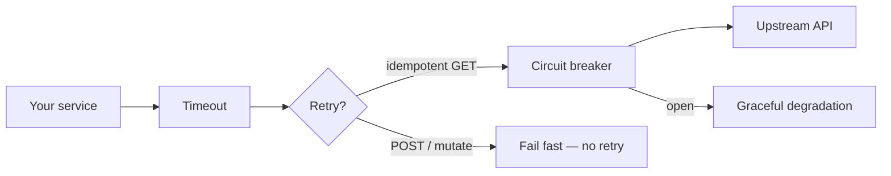

Resilience — overview
Outbound calls and slow dependencies will fail. **Resilience** patterns keep your service responsive: fail fast, retry only when safe, and degrade gracefully instead of cascading outages.

These templates focus on **calling other HTTP services** — pair with [HTTP clients](../http-clients/i-overview.md) for connection setup and auth.

## Mental model



| Pattern | What it does | Default rule |
|---------|--------------|--------------|
| **Timeout** | Cancel work that takes too long | Always set — per request, not "forever" |
| **Retry** | Try again after transient failure | **Idempotent ops only** (GET, HEAD, safe reads) |
| **Backoff** | Wait between retries | Exponential + jitter — don't hammer a sick peer |
| **Circuit breaker** | Stop calling a failing dependency | Open after N failures; half-open probe to recover |
| **Bulkhead** | Isolate resource pools | Separate thread pools / connection limits per dependency |
| **Graceful degradation** | Partial response beats total failure | Cache, stale data, or "feature unavailable" |

## Retry rules (read this twice)

| Safe to retry | **Not** safe to retry |
|---------------|----------------------|
| GET, HEAD, OPTIONS (usually) | POST that creates/charges |
| Read with idempotency key | Any non-idempotent mutation |
| Explicit idempotent PUT with key | Blind retry on 500 after partial write |

Retry on **transient** errors: connection reset, `503`, `429` (respect `Retry-After`). Do **not** retry most `4xx` (client fault).

## Timeouts stack

Set timeouts at **every layer**:

```text
Client timeout  ≤  upstream SLA  <  gateway / load balancer timeout
```

If your handler waits 30s but the gateway kills at 10s, clients see opaque 502s.

## Language templates

| Note | Stack |
|------|--------|
| [Java — Spring](ii-java-spring.md) | `RestClient` + Resilience4j stubs |
| [Python — FastAPI](iii-python-fastapi.md) | `httpx` timeout + tenacity / manual retry |
| [JavaScript — Express](iv-javascript-express.md) | `fetch` + backoff retry wrapper |
| [Go — net/http](v-go-nethttp.md) | `context.WithTimeout` + GET retry loop |

## Notes

| Topic | Practice |
|-------|----------|
| **Timeout first** | No retry logic without a deadline |
| **Idempotency keys** | Required before retrying POST in production |
| **Observability** | Log attempt count, latency, upstream status — see [Middleware](../middleware/i-overview.md) |
| **Test failures** | Inject slow/failing upstreams in integration tests |

## Next

Pick your stack — start with [Java — Spring](ii-java-spring.md) or [Python — FastAPI](iii-python-fastapi.md).
