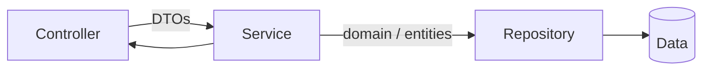

Services — overview
The **service layer** holds **business logic** and orchestrates persistence. Controllers stay thin: parse HTTP → call service → map to response DTOs.

Deep dives: [Spring services](../../languages&frameworks/java/springboot/iv-rest-controllers.md), [Python](../../languages&frameworks/python/i-basics-and-syntax.md), [JavaScript](../../languages&frameworks/javascript/i-overview.md).

## Mental model



| Responsibility | Belongs in service? |
|----------------|---------------------|
| Business rules (duplicate names, quotas) | **Yes** |
| Transaction boundaries | **Yes** |
| CRUD orchestration | **Yes** |
| HTTP status codes | **No** — controller |
| JSON parsing | **No** — controller / DTOs |
| SQL queries | **No** — repository |

**Rule of thumb:** services take domain types or DTOs and return domain types or DTOs — not `ResponseEntity`, `HTTPException`, or `http.ResponseWriter`.

## Language templates

| Note | Stack |
|------|--------|
| [Java — Spring](ii-java-spring.md) | `@Service` + injected repository |
| [Python — FastAPI](iii-python-fastapi.md) | `ItemService` class |
| [JavaScript — Express](iv-javascript-express.md) | `itemService` module |
| [Go — net/http](v-go-nethttp.md) | `ItemService` struct |

## Shared operations (Item resource)

```text
create(name)     → Item
get(id)          → Item | not found
list()           → Item[]
update(id, name) → Item | not found
delete(id)       → ok | not found
```

## Next

Pick your stack — start with [Java — Spring](ii-java-spring.md) or [Python — FastAPI](iii-python-fastapi.md).
