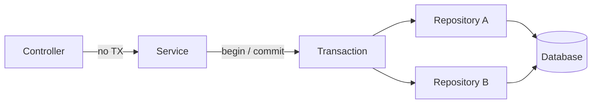

Transactions — overview
A **transaction** groups multiple reads/writes into one atomic unit: all succeed or all roll back. In REST APIs, declare transaction boundaries at the **service layer** — not in controllers, not scattered in repositories.

Pair with [Services](../services/i-overview.md) (orchestration) and [Repositories](../repositories/i-overview.md) (persistence). For safe retries across POST, see [Idempotency](../idempotency/i-overview.md).

## Mental model



| Principle | Why |
|-----------|-----|
| **Boundary at service** | One use-case = one unit of work; controller stays HTTP-only |
| **Short transactions** | Hold locks briefly — no external HTTP, file I/O, or user think-time inside a TX |
| **Read-only when possible** | Skip write locks for pure reads; some stacks optimize `@Transactional(readOnly=true)` |
| **Don't open TX in controllers** | Hard to compose, test, and reuse; leaks persistence into HTTP layer |

## ACID at the service boundary

| Property | Service-layer meaning |
|----------|----------------------|
| **Atomicity** | `createOrder` saves order + line items + inventory decrement — or none |
| **Consistency** | Business invariants enforced before commit (valid totals, no negative stock) |
| **Isolation** | Concurrent requests don't see half-written state (level depends on DB + isolation setting) |
| **Durability** | After commit, data survives crash — DB's job once you commit |

## Read-only vs write

| Operation | Transaction hint |
|-----------|------------------|
| `list()`, `get()` | Read-only or no explicit TX (driver defaults) |
| `create()`, `update()`, `delete()` | Write TX — commit on success, rollback on any failure |
| Mixed read-then-write | Single write TX spanning both steps |

Marking reads **read-only** where supported avoids unnecessary flush/sync and can route to replicas.

## Propagation (brief)

When service A calls service B, frameworks ask: **join the existing TX or start a new one?**

| Propagation (Spring name) | Typical use |
|---------------------------|-------------|
| **Required** (default) | Join caller's TX; create one if missing — most service methods |
| **RequiresNew** | Suspend caller TX; commit independently (audit log, outbox publish) |
| **NotSupported** | Run outside TX (long report, external call) |

Default rule: **one TX per use-case method** unless you have a documented reason to split.

## Anti-patterns

| Anti-pattern | Fix |
|--------------|-----|
| `@Transactional` on controller | Move to service |
| TX spans outbound HTTP call | Commit before calling external API; use saga/outbox if cross-service |
| Long-running TX | Shorten; batch work outside TX or use async jobs |
| One giant TX for whole request pipeline | Scope to the mutating service method only |

## Language templates

| Note | Stack |
|------|--------|
| [Java — Spring](ii-java-spring.md) | `@Transactional` on service |
| [Python — FastAPI](iii-python-fastapi.md) | SQLAlchemy session scope |
| [JavaScript — Express](iv-javascript-express.md) | DB client transaction notes |
| [Go — net/http](v-go-nethttp.md) | `sql.Tx` Begin / Commit / Rollback |

## Shared scenario (Item resource)

```text
POST /items  →  service.create(name)
                 └─ TX: insert item (+ any related rows) → commit
```

## Next

Pick your stack — start with [Java — Spring](ii-java-spring.md) or [Python — FastAPI](iii-python-fastapi.md).
