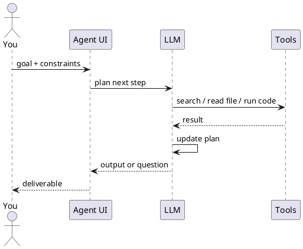

Chat, assistant & agent

## 1. Chat vs assistant vs agent

| Mode | You give | AI does |
|------|----------|---------|
| **Chat** | Question | Single reply |
| **Assistant** | Question + saved docs/instructions | Reply grounded in your knowledge |
| **Agent** | **Goal** | Plan → act → observe → repeat until done or blocked |

```text
Goal: "Find last quarter's churn drivers from these CSVs and slide outline"

Agent loop:
  1. Inspect files
  2. Run analysis / search
  3. Draft outline
  4. Ask you one clarifying question OR deliver
```

## 2. What “agentic orchestration” means for users

**Orchestration** = coordinating **steps and tools** to complete a workflow.

| Layer | User-facing example |
|-------|---------------------|
| **Single agent** | Cursor Agent: edit repo from a task description |
| **Tool use** | ChatGPT with browsing + Python + your Google Drive |
| **Multi-agent** (product-managed) | Research mode that searches, reads, synthesises |
| **External orchestration** | Zapier/Make: trigger → AI step → post to Slack |

You design **goals and guardrails**; the product runs the loop.



## 3. LLM にツールを追加する方法

**ツール**は、モデルがテキスト生成だけでなく、ホストアプリ経由で**依頼できる操作**です — Web 検索、ファイル読み取り、コード実行、API 呼び出し。ツールが増えると、上記のエージェントループで LLM が**実行できること**が増えます。

モデルの重みは変えません。**ホストがツール呼び出しループに載せる能力**を増やします。

```text
ツールを有効化  →  ホストが名前と説明を登録  →  LLM がツール選択  →  ホストが実行  →  結果を LLM に返す
```

| 追加するもの | LLM が得るもの |
|--------------|-------------------|
| Web 検索 | 最新情報、ドキュメント、引用 |
| コードインタプリタ | グラフ、CSV 分析、短いスクリプト |
| ファイル / ドライブ連携 | 貼り付けなしで自社ドキュメント |
| GitHub / Linear MCP | Issue、PR、ライブチケット |
| ターミナル（IDE エージェント） | テスト、ビルド、git |
| スキル + スクリプト | エージェントが実行する定型 API ワークフロー |
| スクリプトを包んだ MCP / Action | 同じスクリプトを `translate` という名前のツールとして公開 |

### オプション A — 組み込みツール（UI でオン）

多くのチャット製品はツールを同梱しています。**チャットまたはワークスペースで有効化**します。

| 製品 | 典型的な組み込み | 追加の仕方 |
|---------|-------------------|------------|
| **ChatGPT** | ブラウジング、Code Interpreter、画像 | モデル選択 / エージェントモード。自社 API は Custom GPT **Actions** |
| **Claude** | Web 検索、分析、computer use（利用可能な場合） | Project / チャット設定。**コネクタ**で Drive、GitHub |
| **Gemini** | Google 検索、Workspace | Gemini の拡張 |
| **Cursor** | コードベース、ターミナル、ブラウザ、編集 | Agent モード、`@` でファイルと docs |
| **Copilot** | M365 graph、リポジトリ文脈 | テナントプラグイン / Copilot Studio |

カスタム配線の前にここから — 権限承認以外の設定はほぼ不要です。

### オプション B — アプリコネクタ（OAuth）

**コネクタ**で、ホストが既存 SaaS のデータを読んだり操作したりします。

```text
設定 → Google Drive / Slack / GitHub を接続 → OAuth スコープ承認 → モデルが接続データを検索・要約
```

| 向く用途 | 注意 |
|----------|-----------|
| コピペ削減 | AI に見せてよいデータだけ接続 |
| 鮮度の高い文脈 | スコープが広すぎると過剰アクセス |

[オーケストレーションパターン](../tools-and-orchestration/iii-orchestration-patterns.md) のコネクタ節と同じ考え方です。

### オプション C — MCP サーバー（IDE・デスクトップを拡張）

**MCP（Model Context Protocol）** は小さなコネクタプログラムで**カスタムツール**を追加 — Postgres、Sentry、社内 API など。

| ステップ | 作業 |
|------|--------|
| 1 | MCP サーバーを選ぶ・入れる（`@modelcontextprotocol/server-github`、ベンダープラグイン、チーム HTTP サーバー） |
| 2 | ホストに設定（Cursor の `mcp.json`、Claude Desktop 設定） |
| 3 | トークンは env — git に入れない |
| 4 | ホスト再起動。ツール一覧に表示 |
| 5 | 自然言語で依頼。モデルが `search_issues`、`run_query` などを選択 |

**Cursor `mcp.json`（概念）:**

```json
{
  "mcpServers": {
    "github": {
      "command": "npx",
      "args": ["-y", "@modelcontextprotocol/server-github"],
      "env": { "GITHUB_PERSONAL_ACCESS_TOKEN": "..." }
    }
  }
}
```

配線は **JSON-RPC**（stdio または HTTP）。プロンプトに手書きするものではありません。詳細: [How MCP works](../how-mcp-works/i-overview.md)。

### オプション D — カスタムアクション / 自社 API（上級者）

| 仕組み | 向く用途 |
|-----------|-----|
| **Custom GPT Actions** | OpenAPI スキーマ → ChatGPT が HTTPS エンドポイントを呼ぶ |
| **Claude tool use + MCP** | デスクトップ / API 連携の同パターン |
| **Zapier / Make / n8n** | ワークフロー内の LLM ステップ。ツール = 他 SaaS ノード |
| **自社バックエンド** | `tools` 付きで LLM API を呼ぶ — 開発者向け |

**非開発者**には、Custom GPT Actions と自動化プラットフォームが「もう一つツールを足す」典型手段です（CRM 作成、Slack 投稿など）。

### オプション E — スキルとスクリプト呼び出し（ツールになるか？）

**短い答え:** **スキルはツールではない**。**スクリプトはなれる**。

| 要素 | 何か | 呼び出し可能なツール？ |
|-------|------------|----------------|
| **スキル（`SKILL.md`）** | いつ・どのコマンド・出力形式の指示 | **いいえ** — **コンテキスト**（手順書）として読み込まれる |
| **スクリプト（`translate.py`）** | API を叩いて結果を出すコード | **はい** — ホストが**実行できる**とき（ターミナル、MCP、Action バックエンド） |
| **スキル + スクリプト** | スキルが「翻訳はこのスクリプト」と指示 | **間接的なツール** — モデルは **ターミナル実行**や包んだ **`translate`** を呼ぶ |

```text
スキル     →  「翻訳依頼は scripts/translate.py を使う」
スクリプト   →  Google Translation API を呼び JSON/テキストを返す
ホストツール →  シェル（Cursor Agent）または MCP または HTTPS Action
LLM       →  ツール結果を見てユーザー向けに返答
```

同じスクリプトの配線例:

| 配線 | スクリプト実行者 | モデルが見るもの |
|--------|---------------------|------------|
| **IDE エージェント + スキル** | ホストが `python scripts/translate.py …` をターミナルで実行 | ターミナル出力がツール結果 |
| **MCP サーバー** | MCP が内部でスクリプトまたは HTTP を実行 | ツール一覧の `translate` |
| **Custom GPT Action** | 小さな API がサーバー側でスクリプト実行 | OpenAPI の `translateText` |

チーム・リポジトリ・env の API キーだけで始めたいときに向きます。初日からフル MCP は不要です。

#### 例: Google Cloud Translation API で翻訳

**1.** [Cloud Translation API](https://cloud.google.com/translate/docs) を有効化し API キーを作成（本番では IP 制限やシークレット管理を推奨）。

**2. スクリプト** — `scripts/translate.py`（標準ライブラリのみ。キーは env）:

```python
#!/usr/bin/env python3
"""Usage: python scripts/translate.py "Hello team" ja"""
import json
import os
import sys
import urllib.parse
import urllib.request

API_KEY = os.environ["GOOGLE_TRANSLATE_API_KEY"]

def translate(text: str, target: str = "en") -> str:
    params = urllib.parse.urlencode({"q": text, "target": target, "key": API_KEY})
    url = f"https://translation.googleapis.com/language/translate/v2?{params}"
    with urllib.request.urlopen(url) as resp:
        data = json.load(resp)
    return data["data"]["translations"][0]["translatedText"]

if __name__ == "__main__":
    text = sys.argv[1]
    target = sys.argv[2] if len(sys.argv) > 2 else "en"
    print(translate(text, target))
```

```bash
export GOOGLE_TRANSLATE_API_KEY="your-key"
python scripts/translate.py "Welcome to the beta" ja
# → ベータ版へようこそ
```

**3. スキル** — `.cursor/skills/translate/SKILL.md`（または `.claude/skills/…`）:

```markdown
---
name: google-translate
description: Translate user text via scripts/translate.py and Google Translation API. Use when the user asks to translate, localize, or convert text to another language.
---

# Translate

1. Detect target language from the user request (default `en`).
2. Run: `python scripts/translate.py "<text>" <target_lang_code>`
3. Return the script output verbatim; do not invent translations.
4. API key is in env `GOOGLE_TRANSLATE_API_KEY` — never print it.
```

**4. Cursor Agent でユーザーが依頼:**

```text
Translate this sentence to Japanese: "Ship date is April 15."
```

**5. 内部の流れ:**

```text
スキル読み込み → ターミナルツール選択 → スクリプト実行 → 「発売日は4月15日です」 → 返答
```

これが **スクリプト呼び出しをツールとして使う**パターンです。LLM が Google を直接叩くのではなく、**ホストがコードを実行**して結果を渡します。

**同じロジックを正式なツールに:** `translate()` を MCP の `translate` ツールに包む、または Custom GPT 用に `POST /translate` を OpenAPI で公開 — HTTP/MCP 層がツール、スクリプトは中身です。

| 方式 | 向く場面 |
|----------|-----------|
| スキル + ターミナル | 個人開発、Cursor/Claude Code、社内ユーティリティ |
| MCP ラッパー | 共有ツール一覧、監査、任意シェル禁止 |
| Custom GPT Action | ChatGPT のみの非技術ユーザー |

#### トークン使用量は減るか？

**状況による — 多くは「セッション全体では減る」が、スキルとスクリプトの効き方は別。**

| 要素 | トークンへの影響 | 理由 |
|-------|--------------|-----|
| **スキルがコンテキストに載る** | **消費する** | `SKILL.md` の本文がプロンプトに加わる（製品により関連時のみ） |
| **スクリプト / API ツールの結果** | **たいてい節約** | 長い生成や推論の代わりに**短い事実**（翻訳 1 行）が返る |
| **やり直しが減る** | **節約** | 一度で正しいコマンド vs 何度も「やり直して」 |
| **ツール呼び出し 1 ラウンド** | **消費する** | ツール名・引数 JSON・結果が次の LLM ターンのコンテキストに入る |

**翻訳例の比較:**

| 方式 | トークンのイメージ |
|----------|---------------------|
| LLM がチャット内で翻訳 | 回答全文の出力トークン + ときどき思考連鎖 |
| 毎回 Google API ドキュメントを貼る | 毎セッション大きな**入力** |
| スキル 1 回 + スクリプト呼び出し | スキルは一度のコスト。ツール結果は短い 1 行。API 仕様はモデルに入れない |

```text
高コスト:  毎チャット 2 ページの翻訳ルールを貼る
低コスト:  必要時だけ SKILL.md（数十行）+ ツール結果「発売日は4月15日です」
```

**トークンが減りやすいとき:**

- スクリプトが**コンパクト**なデータだけ返す（翻訳、価格、ステータス）— ログ全量ではない
- スキルが**毎回貼っていた長い指示**の代わりになる
- **多ターン**の修正ループを避けられる

**減らない・むしろ増えるとき:**

- スキルが**巨大**（マニュアル全文を `SKILL.md` に — `reference.md` + 短いスキルへ）
- 1 タスクで**多数**のツールが連続発火（結果がすべてコンテキストに積まれる）
- **大量**の MCP ツール有効化 — **説明文だけ**でシステムプロンプトが膨らむ
- スクリプト出力が巨大（DB 全ダンプ）— LLM に返す前に切り詰める

**実務ルール:** スキルは**小さな固定の指示コスト**と**チャットの往復削減**のトレード。スクリプトは**ツール 1 ラウンド**と**API をモデルにシミュレートさせない**のトレード。合わせると**セッション合計**はしばしば減る — 魔法ではなく、同じルールの再送と、コードが済ませたことの再生成をやめるから。

[スキルとエージェント指示](../skills-and-agent-instructions/i-overview.md)（短いスキルの書き方）、[How MCP works](../how-mcp-works/i-overview.md) も参照。

### モデルが実際に見るもの

LLM に生の API キーは渡りません。**ツールカタログ**を見ます。

| フィールド | 役割 |
|-------|---------|
| **名前** | `get_issue`、`search_docs` |
| **説明** | いつ使うか — 説明の質が正しい選択に効く |
| **パラメータ** | ホストが検証する JSON スキーマ |

説明を良くする → 誤ったツール呼び出しが減る。ミスが多いときは説明を絞るか、同時に有効なツール数を減らす。

### 実践チェックリスト

| ステップ | やること |
|------|-----|
| 1 | エージェントに必要な**読み取り**と**書き込み**を列挙（まず読み取り専用） |
| 2 | **組み込み**で 80% をカバー（検索、ファイル、コード） |
| 3 | ドキュメント置き場に**コネクタ** |
| 4 | チャットで届かないライブ系だけ **MCP** |
| 5 | **OAuth / トークンスコープ**を最小化。シークレットをローテーション |
| 6 | 明確な目標でテスト:「オープンな P1 バグを探して要約」 |

| 避ける | 理由 |
|-------|-----|
| すべての MCP を一度に有効化 | 誤ツール選択。攻撃面が広がる |
| 人のレビューなしの書き込みツール | 投稿・削除・API 課金のリスク |
| コネクタ + MCP + アップロードで同じデータを重複 | 文脈の矛盾 |

**関連:** [スキルとエージェント指示](../skills-and-agent-instructions/i-overview.md)、[How MCP works](../how-mcp-works/i-overview.md)、[オーケストレーションパターン](../tools-and-orchestration/iii-orchestration-patterns.md)、[エージェントの指示](iii-directing-agents.md)、[信頼と検証](../trust-privacy-and-verify/i-overview.md)。