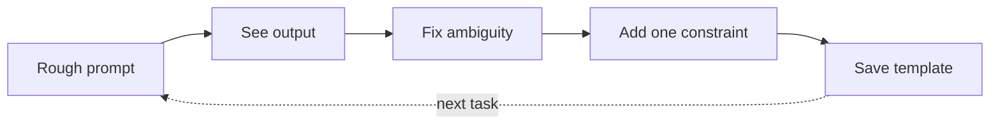

Iteration & templates

## 3. Iteration loop (how pros work)



| Feedback to the model | Better than |
|-----------------------|-------------|
| “Shorter; drop adjectives; keep all dates.” | “Try again.” |
| “Wrong: revenue is in table 2, not table 1.” | “That’s wrong.” |
| “Use the template in my first message.” | Starting a new chat |

**New chat vs continue:** new chat when topic changes or context is polluted; continue when refining the same deliverable.

## 4. Templates by task type

### Summarise

```text
Summarise for a busy [role].
Length: [N bullets / N words].
Include: decisions, open questions, owners.
Exclude: background I already know.
Source:
"""
…
"""
```

### Compare options

```text
Compare A vs B for [decision].
Criteria: cost, risk, time, quality (weight quality highest).
Output: table + one-paragraph recommendation.
Context: …
```

### Code help (without shipping blindly)

```text
Language: [X]. Goal: [one sentence].
Show approach first, then code.
Flag assumptions and edge cases.
Do not invent APIs — say if unsure.
```

### Email / message draft

```text
Tone: [direct / warm / formal].
Relationship: [client / manager / peer].
Goal: [what should reader do after reading].
Facts only from below — do not invent names or dates.
```