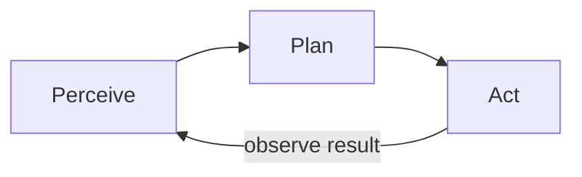

エージェントとエージェントのワークフロー — 概要
**エージェントとエージェントのワークフロー**について詳しく説明します。以下で焦点を絞ったメモに分割します。

## このサブメニューのマップ

|注 |フォーカス |
|------|----------|
| [チャット、アシスタント、エージェント](ii-chat-assistant-agent.md) | モード比較。ツール（組み込み、MCP、スキル+スクリプト例: Translate API） |
| [Directing agents](iii-directing-agents.md) |エージェントとエージェント ワークフロー トラックの一部 |
| [製品と関係者](iv-products-and-human-in-the-loop.md) |エージェントとエージェント ワークフロー トラックの一部 |

エージェントとエージェントのワークフロー
**AI エージェント** (使用している製品内) は、一度で答えるのではなく、**複数のステップ** (計画、**ツール** (検索、コード、ファイル、API) の呼び出し、何かが失敗した場合の調整) にわたって目標を追求するモデルです。

自分でエージェントを導入するわけではありません。 Cursor、ChatGPT、Claude、Copilot、自動化プラットフォームで**指示**します。

## 勉強の順番

[チャット、アシスタント、エージェント](ii-chat-assistant-agent.md) → [監督エージェント](iii-directing-agents.md) → [製品と参加者](iv-products-and-human-in-the-loop.md)
