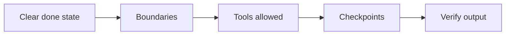

ディレクションエージェント

## 3. エージェントが助けるときと傷つけるとき

|エージェントにとって良い |普通のチャットの方が良い |
|-----------------|---------------------|
|複数ファイルのコーディングタスク |一回限りの定義 |
|多くの情報源にわたる調査 |短いリライト |
|チェックを伴う反復操作 |審査なしのセンシティブな取り消し不能な行為 |
| 「このリポジトリがどのように機能するかを理解する」 | 1 つのドキュメントで確認できる事実の検索 |

|リスク |緩和 |
|------|-----------|
|間違ったファイルが編集されました |小さなタスク。差分を確認する |
|発明された引用 |リンクが必要です。検証する |
|暴走スコープ | 「ステップ 3 の後で停止し、計画を表示」 |
|コスト/時間 |制限を設定します。ドラフトには小さいモデルを使用する |

## 4. エージェントをうまく指示する方法

[効果的なプロンプト](../effective-prompting/i-overview.md)、プラス:

|追加 |例 |
|-----|----------|
| **完了状態をクリア** | 「完了時期: PR-ready diff + テスト コマンド出力。」 |
| **境界** | 「次のファイルは変更しないでください」`/legacy`」 |
| **許可されるツール** | 「リポジトリ検索のみを使用してください。ウェブはありません。」 |
| **チェックポイント** | 「計画の後、私の OK を待ってから編集してください。」 |
| **検証** | 「テストを実行し、概要を貼り付けます。」 |

**Cursor / IDE エージェント:** フォルダーを指し、スタックに言及し、既存のパターンを参照します (「一致`UserService`スタイル"）。

**調査エージェント:** 日付範囲、優先ソース、出力スキーマ (表、メモ、スライド) を指定します。