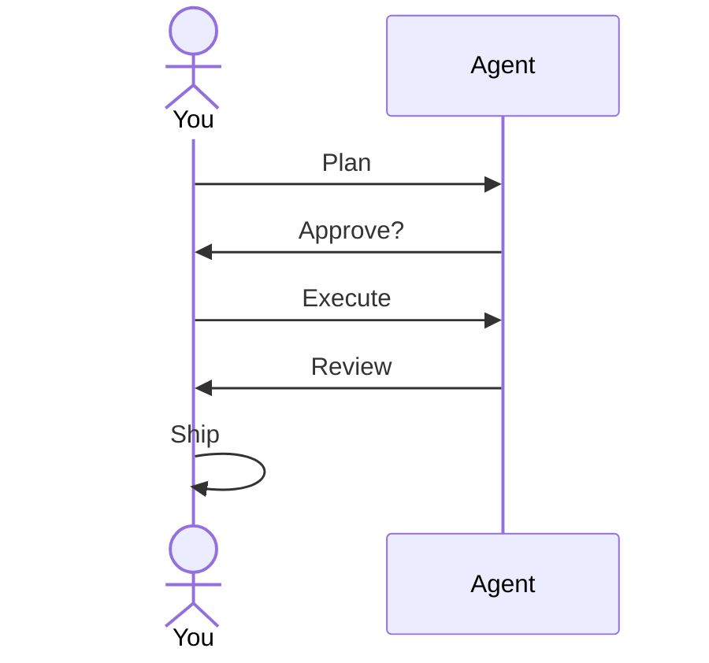

製品と人間関係者

## 5. 製品における薬剤パターン (2025 ～ 2026 年)

|製品分野 |エージェントのような動作 |
|--------------|---------------------|
| **Cursor エージェント** |複数ファイルのコード変更、ターミナル、ブラウザ |
| **チャットGPT** |エージェント モード、詳細な調査、コネクタ |
| **クロード** |プロジェクト + ツールの使用、コンピューターの使用 (有効な場合) |
| **Microsoft Copilot** | M365 グラフ + テナント内のアクション |
| **デビン / コーディング エージェント** |長期的なソフトウェア タスク (人間によるレビューが重要) |

機能は急速に変化しますが、**目標、制約、検証**という原則は変わりません。

## 6. 人間参加型

エージェントの出力を **ドラフト** として扱います:

法務、医療、財務、実稼働環境の展開の場合: **あなた**は責任を負います。エージェントは優秀なインターンです。

## 7. リハーサルの質問

- エージェントは長いチャット スレッドとどう違うのですか?
- エージェントにコードを編集させる前に、2 つのガードレールに名前を付けます。
- 非開発者にとってオーケストレーションを一言で言うと何ですか?

**関連:** [ツールとオーケストレーション](../tools-and-orchestration/i-overview.md)、[スキルとエージェントの指示](../skills-and-agent-instructions/i-overview.md)、[信頼して検証](../trust-privacy-and-verify/i-overview.md）。