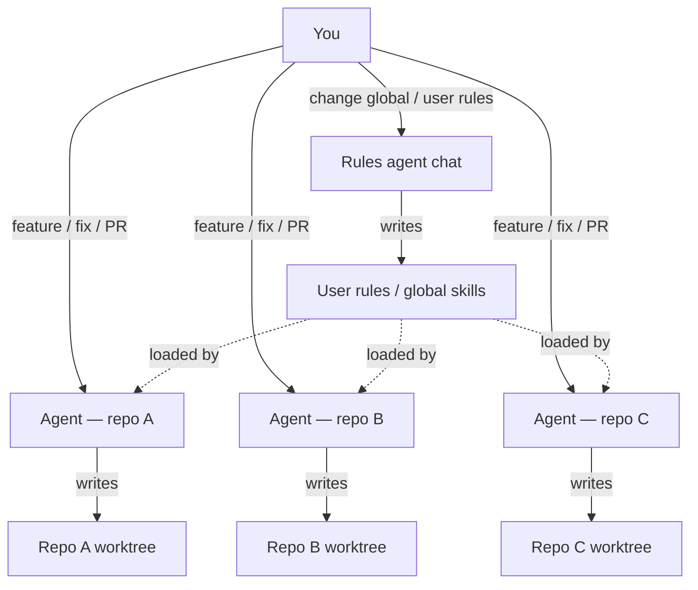
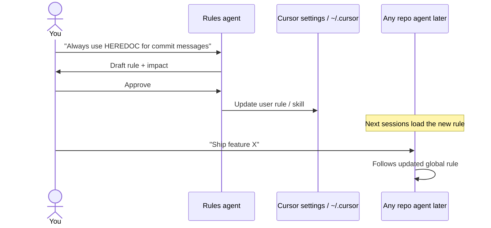
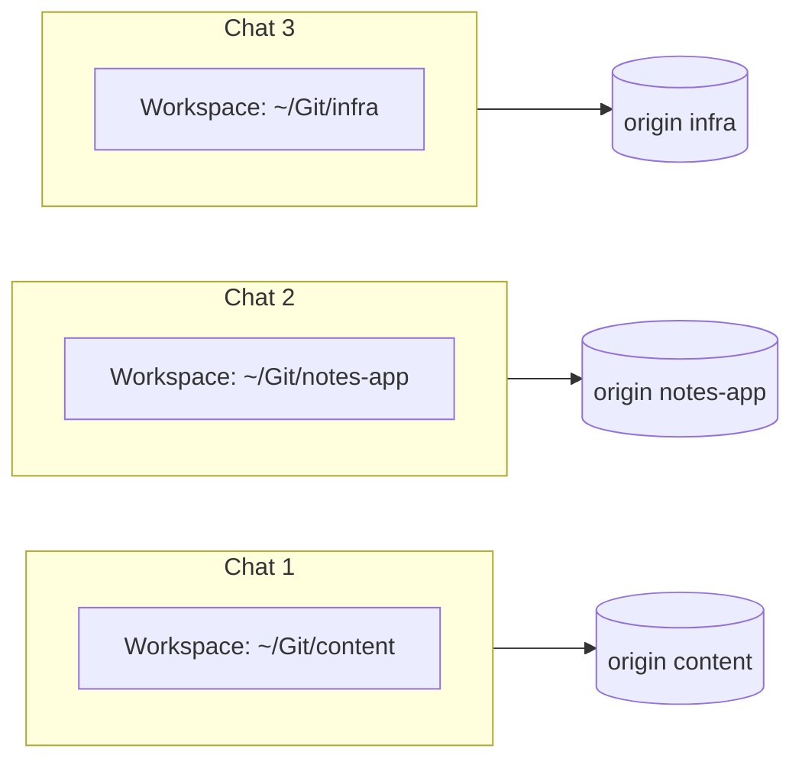
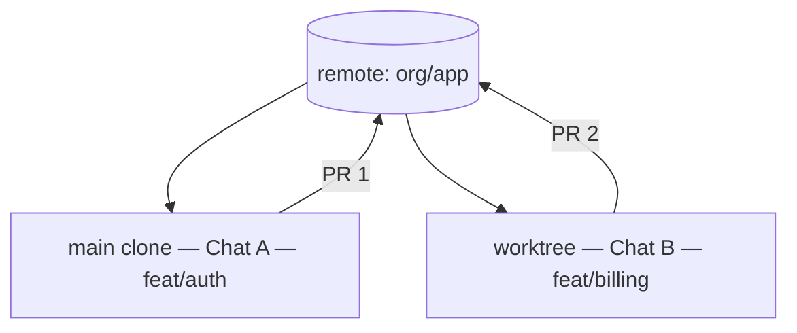
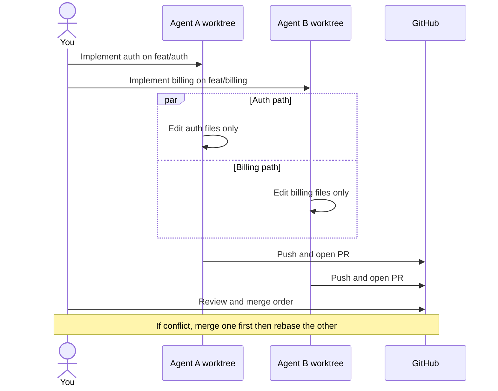
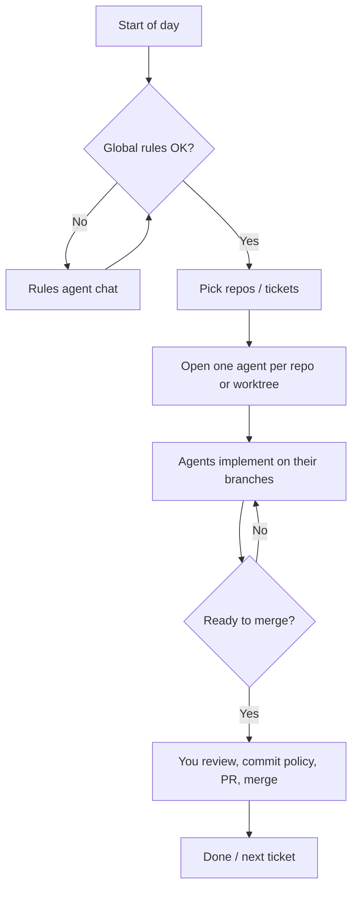

私のセットアップ — マルチエージェント Cursor ワークフロー
**Cursor エージェント**を毎日どのように実行しているか: 1 つのチャットが **グローバル ルール**を所有し、他のチャットが **リポジトリ作業**を行い、複数のエージェントが同じコードベースに触れるときの **並行作業**を安全に保ちます。

これは個人の運用モデルであり、製品要件ではありません。関連: [監督エージェント](iii-directing-agents.md)、[Cursor スキル、ルール & AGENTS.md](../skills-and-agent-instructions/iv-cursor-skills-rules-agents-md.md)、[エージェント オーケストレーション](../skills-and-agent-instructions/using-skills-agents-and-hooks/vi-agent-orchestration.md）。

## 1. 役割の概要

|エージェントチャット |所有 |所有していない |
|-----------|------|--------------|
| **ルールエージェント** |ユーザー ルール、グローバルな習慣、リポジトリ間の規則 |製品リポジトリの機能 PR |
| **レポエージェント** |それぞれ 1 つ (またはいくつか) の git リモート/ワークツリー |グローバル ルール セットを「作業中に」編集する |
| **私** |決定をマージします。チャットが書き込みを許可される |すべてのツール呼び出しを盲目的に信頼する |



**ルール:** ルール エージェントは **すべてのエージェントの動作**を変更します。リポジトリ エージェントが **コード**を変更します。 1 つのチャットにこれらのジョブを混在させると、予期せぬ差分や中途半端なルール編集が発生します。

## 2. ルールエージェント (グローバル)

唯一の役割が指示領域である **専用チャット** (多くの場合、スクラッチ ワークスペースやメモ ワークスペース) を使用します。

|レイヤー |典型的な場所 |範囲 |
|------|------|------|
| **ユーザールール** | Cursor ユーザー ルール (アカウント/設定) |すべてのプロジェクト |
| **ユーザースキル** |`~/.cursor/skills/`|すべてのプロジェクト |
| **ユーザーフック** |ユーザーレベルのフック (使用する場合) |すべてのプロジェクト |
| **チームルール** |そのリポジトリを明示的に開いた場合のみ |そのリモコン |

Rules エージェントのプロンプト パターン:

```text
You only edit global / user-level Cursor rules and skills.
Do not change application code in product repos.
Propose the rule text, show before/after, wait for my OK, then apply.
```



ルール チャット (または個人的なメモ) に短い **変更ログ** を記録してください: 日付、変更内容、理由 - これにより、不適切なグローバル指示をロールバックできます。

## 3. リポジトリエージェント (異なるリモート)

**アクティブなリポジトリごとに 1 つのエージェント チャット** (またはエピックごと) をスピンします。編集を要求する前に、ワークスペースのルートがそのクローンを指すようにしてください。



|練習 |なぜ |
|----------|-----|
| **チャットにリポジトリ/チケットの名前を付けます** |文脈のにじみが少なくなる |
| **可能な場合、エージェントごとに 1 つのブランチ** |よりクリーンな PR |
| **ルートを移動できる場合は、エージェントにリポジトリ パスを伝えます** |間違ったツリーを編集しないようにする |
| **チャット B に「グローバル ルールも修正してください」と依頼しないでください** |それがルールエージェントの仕事です |

## 4. 同じリポジトリ、同じ時間

同じファイルをめぐって競合しない限り、**1 つのリモート**上に複数のエージェントが存在しても問題ありません。 **git worktree** (または個別のクローン) を使用して、各チャットが独自のチェックアウトとブランチを持つようにします。



### 調整チェックリスト

|リスク |緩和 |
|------|-----------|
| 2 人のエージェントが同じファイルを編集する |ディレクトリ/所有権ごとに分割。またはシリアル化する |
|両方とも 1 つのブランチにコミットします。 **エージェントごとに 1 つのブランチ**;あなた経由でリベース/マージ |
|プル後のコンテキストが古い |各チャットにいつかを伝えます`main`移動しました |
|フック/ロックファイルの戦い | 2 つのツリーで長いインストーラーを必要なしに同時に実行しないでください。
|飛行中にルールが変更される |リポジトリエージェントを一時停止します。ルールエージェントを更新します。履歴書 |



### 並列化を「しない」場合

- ツリー全体に影響を与える大規模な名前変更/移動  
- 生成された共有ロック (`package-lock.json`) 計画なし  
- 「すべてをリファクタリング」+「ホットフィックスを配布」を同じ時間内に行う

次に: **1 つのエージェント**、または最初にホットフィックス、次にリファクタリングを行います。

## 5. エンドツーエンドの一日の形



## 6. 再利用するプロンプト スニペット

**ルールエージェント**

```text
Scope: user-level Cursor rules only.
Output: proposed rule text, files touched, rollback note.
Do not modify any git repo application source.
```

**レポエージェント**

```text
Repo: <path or name>. Branch: feat/<ticket>.
Do not change user/global Cursor rules.
If a standing rule should change, say so — I will run the Rules agent.
```

**同じリポジトリの並列**

```text
You own paths: <dirs>. Other agent owns: <dirs>.
Do not edit outside your paths. Worktree: <path>. Branch: <name>.
```

## 7. 関連メモ

|トピック |注 |
|------|------|
|エージェントを操作する方法 | [監督エージェント](iii-directing-agents.md) |
|ルール/スキルが存在する場所 | [Cursor スキル、ルール、AGENTS.md](../skills-and-agent-instructions/iv-cursor-skills-rules-agents-md.md) |
|人間の承認ループ | [製品と関係者](iv-products-and-human-in-the-loop.md) |

＃＃ 次

[エージェントとエージェント ワークフローの概要] に戻る(i-overview.md）。
