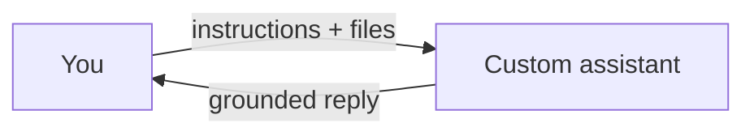

カスタム アシスタントとナレッジ — 概要
**カスタム アシスタントとナレッジ**について詳しく説明します。以下で焦点を絞ったメモに分割します。

## このサブメニューのマップ

|注 |フォーカス |
|------|----------|
| [製品と建築アシスタント](ii-products-and-building-assistants.md) |カスタム アシスタントとナレッジ トラックの一部 |
| [RAG とナレッジ ライブラリ](iii-rag-and-knowledge-libraries.md) |カスタム アシスタントとナレッジ トラックの一部 |
| [メモリとガバナンス](iv-memory-and-governance.md) |カスタム アシスタントとナレッジ トラックの一部 |

カスタムアシスタントとナレッジ
製品を使用すると、**ドキュメントと**説明書**を添付できるため、AI はモデルを自分で微調整することなく、ハンドブックを読んだチームメイトのように回答できます。

## 勉強の順番

[製品と建築アシスタント](ii-products-and-building-assistants.md) → [RAG & ナレッジ ライブラリ](iii-rag-and-knowledge-libraries.md) → [メモリとガバナンス](iv-memory-and-governance.md)
