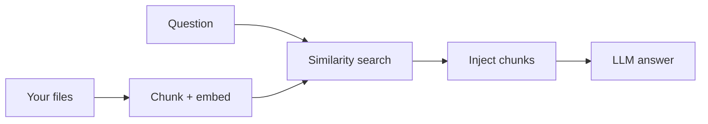

RAG とナレッジ ライブラリ

## 4. 専門用語を使わない RAG

**検索拡張世代 (RAG)** = AI **ファイルを検索**し、**それらのチャンクを使用して書き込みます**。

|あなたはそうします |製品は次のことを行います |
|------|--------------|
| PDF のアップロード / ドライブの接続 |各質問のチャンク、埋め込み、検索 |
|質問する |関連する文章をプロンプトに挿入 |

より良い回答のためのヒント:

|ヒント |なぜ |
|-----|-----|
| **わかりやすいファイル名** |回復と正気の維持に役立ちます |
| **ドキュメントごとに 1 つのトピック** | | 間違ったチャンクが混入するのを減らします。
| **「出典を引用してください」** |検証が簡単 |
| **巨大な PDF を分割** |製品が許可する場合は章ごとに |

技術的な深さ: [LLM RAG](../../llms/v-rag-and-fine-tuning.md)、[注文検索例](../../swe101/sysdesign/examples/viii-order-search-cdc.md）。

## 5. チームのナレッジ ライブラリ

|アプローチ |フィット |
|----------|-----|
| **単一の共有プロジェクト/GPT** |小さなチーム、1 つのドメイン |
| **製品ごとのアシスタント** |さまざまな政策と論調 |
| **Wiki + AI サイドバー** |既存の Wiki 上の Notion AI、Confluence AI |

ガバナンス: アシスタントごとの所有者、ポリシー更新時の変更ログ。