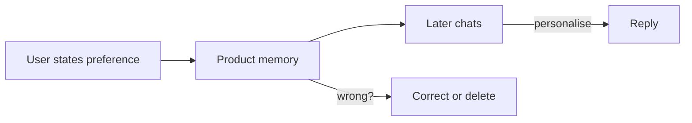

メモリとガバナンス

## 6. メモリ機能

一部の製品は、チャット全体で事実を**記憶**します (「ユーザーは箇条書きを好む」)。

|アップサイド |マイナス面 |
|----------|----------|
|繰り返しが少なくなる |間違った記憶が残る - 修正または削除 |
|パーソナライゼーション |プライバシー — どのベンダーがストアしているかを知る |

**共有マシン**または**機密性の高い作業**のメモリをオフにするかクリアします。

## 7. リハーサルの質問

- カスタム GPT と 1 回限りのチャット — セットアップに価値があるのはどのような場合ですか?
- なぜモデルに情報源の引用を求めるのでしょうか?
- 指示とアップロードされたファイルにはどちらが含まれますか?

**関連:** [効果的なプロンプト](../effective-prompting/i-overview.md)、[信頼して検証](../trust-privacy-and-verify/i-overview.md）。