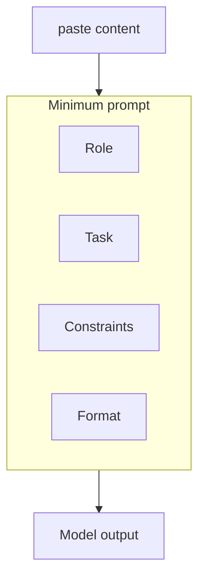

最低限のプロンプトとテクニック

## 1. 最低限の適切なプロンプト

タスクが重要な場合は、次の 4 つの要素を含めます。

|ピース |例 |
|------|-----------|
| **役割/視点** | 「あなたは技術ブログの簡潔な編集者です。」 |
| **タスク** | 「わかりやすくするために、以下の草案を書き直してください。」 |
| **制約** | 「単語数は 300 語以内にし、数字はすべて保持してください。」 |
| **出力形式** | 「箇条書きを使用し、導入段落は使用しません。」 |

弱者：「これをもっと良くしてください。」  
強者: 「具体的な編集を 3 つ挙げてください。それぞれについて、元の文と改訂版を引用してください。」

## 2. 実際に役立つテクニック

|テクニック |いつ使用するか |フレーズ例 |
|----------|---------------|-----|
| **ゼロショット** |シンプルでよく知られたタスク | 「日本語に翻訳：…」 |
| **数ショット** |スタイル テンプレートがあります | 2 つの例を貼り付けて、「今度は同じことを…」 |
| **思考の連鎖** |数学、論理、計画 | 「段階的に考えて、最終的な答えを出す。」 |
| **草案→批評→改訂** |重要な書類 | 「最初の草案、次に弱点のリスト、そして改良版。」 |
| **視聴者切り替え** |同じコンテンツ、異なるリーダー | 「二度説明してください。経営者向け、次にエンジニア向けです。」 |

**思考の連鎖:** 間違いが大きな損害をもたらす場合は、最終的な答えが出る前**に推論を求めます。結論だけが必要な場合は、コピー内の手順を非表示にします。