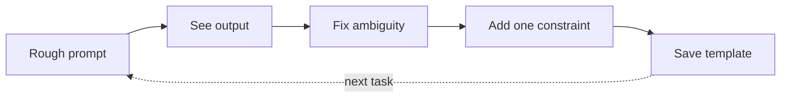

イテレーションとテンプレート

## 3. 反復ループ (プロの作業方法)



|モデルへのフィードバック | | よりも優れています
|----------------------|-----------|
| 「もっと短くし、形容詞を削除し、すべての日付を保持します。」 | "もう一度やり直してください。" |
| 「間違っています。収益は表 1 ではなく、表 2 にあります。」 | 「それは違います。」 |
| 「最初のメッセージにはテンプレートを使用してください。」 |新しいチャットを開始する |

**新しいチャットと継続:** トピックが変更された場合、またはコンテキストが汚染された場合は新しいチャット。同じ成果物を改良するときに続行します。

## 4. タスクの種類別のテンプレート

### 要約

```text
Summarise for a busy [role].
Length: [N bullets / N words].
Include: decisions, open questions, owners.
Exclude: background I already know.
Source:
"""
…
"""
```

### オプションを比較する

```text
Compare A vs B for [decision].
Criteria: cost, risk, time, quality (weight quality highest).
Output: table + one-paragraph recommendation.
Context: …
```

### コードヘルプ (やみくもに出荷することはありません)

```text
Language: [X]. Goal: [one sentence].
Show approach first, then code.
Flag assumptions and edge cases.
Do not invent APIs — say if unsure.
```

### 電子メール/メッセージの下書き

```text
Tone: [direct / warm / formal].
Relationship: [client / manager / peer].
Goal: [what should reader do after reading].
Facts only from below — do not invent names or dates.
```

**次へ:** [システムの指示と間違い](iv-system-instructions-and-mistakes.md）。