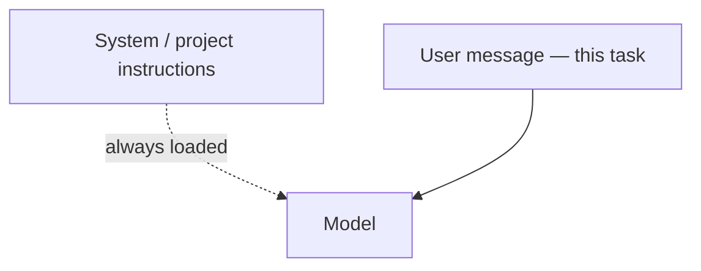

システムの指示と間違い

## 5. システムの指示とチャット メッセージの比較

|製品 | 「常に従う」ルールが生きている場所 |
|---------|---------------------------------|
| **チャットGPT** |カスタム GPT 命令、または最初のメッセージ |
| **クロード** |プロジェクトの指示 |
| **Cursor** |ルール、`.cursorrules`、プロジェクトドキュメント |
| **副操縦士** | VS コードのコパイロット命令 |

**安定した**ルールをシステム/プロジェクトの指示に含めます。 **このタスク**の内容をユーザー メッセージに含めます。

## 6. よくある間違い

|間違い |修正 |
|----------|-----|
|漠然とした目標 | 1 つの測定可能な成果物 |
|テキストの壁、構造なし |見出し、区切り文字`"""…"""`|
|基準を持たずに「最高」を求める |リストの基準または重み |
|事実に関する最初の回答を信頼する |情報源を尋ねてください。 verify ([信頼して検証](../trust-privacy-and-verify/i-overview.md)) |
|シークレットの貼り付け |編集;必要に応じてエンタープライズ層を使用する |

## 7. リハーサルの質問

- 「ミニマムグッドプロンプト」に属する 4 つの作品は何ですか?
- 思考の連鎖が追加のトークンを支払う価値があるのはどのような場合ですか?
- 機能したプロンプトをなぜ保存するのでしょうか?

**次へ:** [ループ プロンプト — 概要](../loop-prompting/i-overview.md）。

**関連:** [エージェントとエージェントのワークフロー](../agents-and-agentic-workflows/i-overview.md)、[カスタムアシスタント](../custom-assistants-and-knowledge/i-overview.md）。