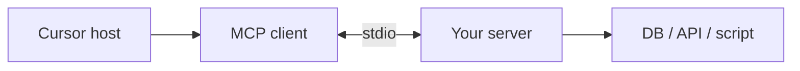

カスタム MCP の作成方法 — 概要
**MCP サーバー** を構築するための実践トラック — **ツール** (およびオプションで **リソース** / **プロンプト**) を公開する小さなプログラムで、Cursor、Claude Desktop、およびその他のホストが **あなたの** API、スクリプト、またはデータを呼び出すことができます。

[MCP の仕組み](../i-overview.md) まず、JSON ～ RPC、stdio と HTTP、およびホスト/クライアント/サーバーの役割について説明します。このトラックは **実装** です: スキャフォールディング → ツールの定義 → テスト → Cursor への接続。

## このサブメニューのマップ

|注 |フォーカス |
|------|----------|
| [サーバーを計画する](ii-plan-your-server.md) |スコープ、ツールとリソース、環境変数、サーバーごとに 1 つのジョブ |
| [SDK を使用してビルドする](iii-build-with-the-sdk.md) | TypeScript と Python プロジェクトのセットアップ |
| [ツール、リソース、プロンプト](iv-tools-resources-and-prompts.md) |スキーマ、ハンドラー、エラー形状 |
| [テストして Cursor に接続](v-test-and-wire-cursor.md) | MCP 検査官、`mcp.json`、デバッグ |
| [セキュリティと配布](vi-security-and-distribution.md) |シークレット、スコープ、npm/pip、チーム ロールアウト |

## あなたが構築しているもの

|あなたはこう書きます |ホストハンドル |
|----------|--------------|
|ツール名、入力スキーマ、ハンドラー ロジック |生成プロセス、JSON-RPC、LLM ツールの選択 |
|環境ベースのシークレット (`API_KEY`) |環境を注入しています`mcp.json`|
|テキスト / JSON を MCP で返します`content`|ツールの結果をモデルにフィードする |

## カスタム MCP が意味をなす場合

|カスタム MCP をビルドする |代わりに既存の / スキルを使用する |
|-----------------|----------------------------|
|内部 API または DB はチームのみが持つ |正式`@modelcontextprotocol/server-*`すでに存在します |
|反復可能なエージェントのアクション (チケットの作成、クエリの実行) |単発指示 → [スキル](../../skills-and-agent-instructions/i-overview.md) |
| Cursor + Claude Desktop の同じコネクタ |モデルが毎回読み取る必要がある静的ドキュメント |

## 勉強の順番

[サーバーを計画する](ii-plan-your-server.md) → [SDK でビルドする](iii-build-with-the-sdk.md) → [ツール、リソース、プロンプト](iv-tools-resources-and-prompts.md) → [テストして Cursor に配線](v-test-and-wire-cursor.md) → [セキュリティと配布](vi-security-and-distribution.md)

## 前提条件

|スキル |なぜ |
|------|-----|
|基本 **JSON** |ツールの入力/出力は JSON 形状です。
| **ノード 18+** または **Python 3.10+** |公式 MCP SDK |
|ラップする 1 つの **外部システム** | REST API、Postgres、ファイルシステム パス、シェル スクリプト |

**仕様参照:** [modelcontextprotocol.io](https://modelcontextprotocol.io)
