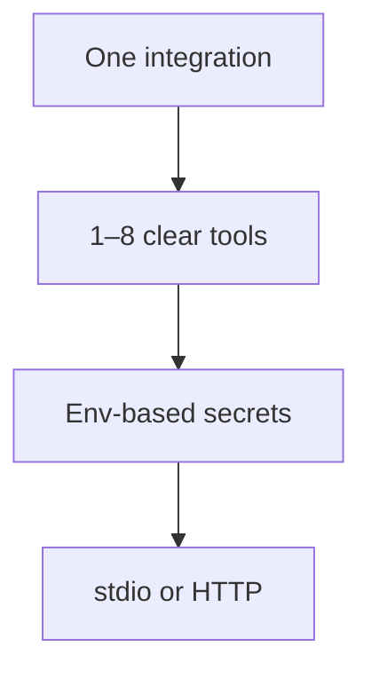

サーバーを計画する

コードを記述する前に、*エージェントが実行できること**と**決して実行してはいけないこと**を決定してください。 MCP サーバーは小規模なコネクタであり、完全なアプリケーションではありません。



## 1. 1 つのサーバー、1 つの統合

|良い |避ける |
|------|------|
|`company-crm-mcp`— CRM 検索 + リードの作成 | CRM + GitHub + 電子メール + シェル用の 1 つのメガサーバー |
|`team-runbooks-mcp`— 内部 Wiki ページを読む |すべてのデータベース テーブルを個別のツールとして公開する |
|`deploy-status-mcp`— クエリ CI / リリース API |ガードレールのないモデルから生の SQL を渡す |

ホストには、有効なサーバーからの **すべてのツール** がリストされます。より少ない、より明確なツール → LLM によるより適切なツールの選択。

## 2. ツール、リソース、プロンプト

| MCP プリミティブ |それは何ですか |例 |
|---------------|-----------|----------|
| **ツール** |引数を指定してモデルを **呼び出し**する関数 |`search_issues`、`run_health_check`|
| **リソース** | **読み取り可能** URI ユーザーまたはモデルは | を取得できます。`runbook://oncall/checkout`|
| **プロンプト** |ホストが挿入できる事前構築済み **テンプレート** |`summarize-incident`スロット付き |

**ツールのみから始めてください** — これらのツールはカスタム統合の 90% をカバーします。エージェントが安定したドキュメントを**読み取る**必要がある場合は、リソースを追加します。再利用可能なスラッシュ コマンド スタイルのテンプレートが必要な場合は、プロンプトを追加します。

## 3. 各ツールを設計する

すべてのツールについて、コーディングする前に 1 行の仕様を作成します。

|フィールド |質問 |
|------|----------|
| **名前** | Snake_case 動詞句 —`get_order`、 ない`order`|
| **説明** |それが何をするのか **そしていつ** モデルがそれを使用すべきか (ホストはこれを LLM に示します) |
| **入力** |最小限の JSON スキーマ — 必須とオプション |
| **出力** |モデルのテキスト概要、またはテキストとして構造化された JSON |
| **副作用** |読み取り専用と書き込み — 説明で破壊ツールを明確にマークします。
| **認証** | API トークンを提供する環境変数または構成ファイルはどれですか。

```text
Tool: search_customers
Description: Search CRM by email or company name. Read-only. Use when user asks about a customer record.
Inputs: { "query": string, "limit"?: number }
Output: JSON array of { id, name, email } (max 10)
Auth: CRM_API_KEY from environment
```

## 4. 設定と秘密

|パターン |使用 |
|----------|-----|
| **環境変数** | API キー、ベース URL — ホストによって挿入される`mcp.json`|
| **構成ファイルのパス** |`CONFIG_PATH`YAML を指し、サーバーは起動時に読み取ります。
| **リポジトリにはシークレットはありません** |決してトークンをコミットしないでください。 README で必要な環境変数を文書化する |

```json
"env": {
  "CRM_API_KEY": "from-your-secret-store",
  "CRM_BASE_URL": "https://crm.internal.example"
}
```

## 5. 輸送手段の選択

|輸送 |いつ |
|-----------|------|
| **stdio** (デフォルト) |ローカル開発者、Cursor、クロード デスクトップ — ホストがプロセスを生成します |
| **ストリーミング可能な HTTP** |チームホスト型コネクタ、共有サービス、リモートエージェント |

このトラックは **stdio**、つまり動作するカスタム サーバーへの最速パスに焦点を当てています。 [JSON-RPC とトランスポート](を参照してください)../ii-json-rpc-and-transports.md) HTTP デプロイメント用。

## 6. コーディング前のチェックリスト

- [ ] サーバー名とバージョン (`my-team-crm`、`1.0.0`)
- [ ] 1 ～ 8 のツールのリストと説明
- [ ] 環境変数を文書化
- [ ] 読み取りツールと書き込みツールが識別されました。可能な場合、書き込みには製品 UX での人間参加が必要です
- [ ] エラー メッセージは **実用的なテキスト** (レート制限、404、無効な ID) を返します - モデルはそれらを読み取ります

＃＃ 次

[SDK を使用してビルドする](iii-build-with-the-sdk.md) — TypeScript または Python をスキャフォールドします。
