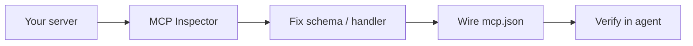

テストして Cursor に配線する

## 1. MCP インスペクター (最速のフィードバック)

公式 **MCP インスペクター** は、Cursor を使用せずに標準入出力経由でサーバーと通信します。

```bash
npx @modelcontextprotocol/inspector node /absolute/path/to/my-mcp-server/dist/index.js
# Python:
npx @modelcontextprotocol/inspector python /absolute/path/to/my-mcp-server/server.py
```

|検査官 UI |何を確認するか |
|--------------|----------------|
| **ツール** タブ |すべてのツールがスキーマとともにリストされています |
| **ツールの呼び出し** |走る`echo`サンプル引数を使用して — 応答を確認します。
| **ログ** | JSON-RPC エラー、スタック トレース |

Cursor を開く前に、ここでスキーマとハンドラーのバグを修正してください。



## 2. ローカルログのヒント

|ヒント |なぜ |
|-----|-----|
| **一度もない`console.log`stdio サーバーの stdout** へ | stdout は JSON-RPC ワイヤです - プロトコルが破損します |
| **stderr** にログを記録する |`console.error(...)`/`logging`標準エラー出力は安全です。
|ログツール名 + 期間 |遅い API 呼び出しをデバッグする |

```typescript
console.error(`[get_issue] id=${issue_id} duration_ms=${Date.now() - t0}`);
```

## 3. Cursor`mcp.json`

プロジェクトレベル (チームにコミット) —`.cursor/mcp.json`:

```json
{
  "mcpServers": {
    "my-mcp-server": {
      "command": "node",
      "args": ["/absolute/path/to/my-mcp-server/dist/index.js"],
      "env": {
        "CRM_API_KEY": "your-key-here"
      }
    }
  }
}
```

Python の例:

```json
{
  "mcpServers": {
    "my-mcp-server": {
      "command": "/absolute/path/to/my-mcp-server/.venv/bin/python",
      "args": ["/absolute/path/to/my-mcp-server/server.py"],
      "env": {
        "CRM_API_KEY": "your-key-here"
      }
    }
  }
}
```

|フィールド |メモ |
|------|------|
|`command`|実行可能ファイル — venv には絶対パスを使用します`python`|
|`args`|最初の引数としてスクリプト パス |
|`env`|シークレット - 実際のキーのユーザーレベルの上書きを優先します。

**ユーザー グローバル** 構成も機能します: Cursor 設定 → MCP → サーバーを追加 (同じ形状)。

保存後、**MCP** を再起動するか、Cursor をリロードし、IDE で MCP のステータスを確認します。

## 4. npm にリンクされた TypeScript サーバー

開発中:

```json
{
  "mcpServers": {
    "my-mcp-server": {
      "command": "npx",
      "args": ["-y", "tsx", "/path/to/my-mcp-server/src/index.ts"],
      "env": { "CRM_API_KEY": "..." }
    }
  }
}
```

またはローカルに公開します。`npm link`そして`"command": "my-mcp-server"`。

## 5. Cursor で確認する

1. チャット/エージェントモードを開きます。
2. 質問します: *「挨拶するにはエコー ツールを使用してください」* — または次のような実際のツールを使用します。`search_issues`。
3. エージェントがサーバーを呼び出すことを確認します (UI の MCP ツール呼び出し)。
4. ツールが不足している場合: MCP パネルで接続エラーがないか確認します。

|症状 |修正 |
|----------|-----|
|サーバーが切断されました |間違った道です。再構築する`dist/`;行方不明のシバン`#!/usr/bin/env node`|
|ツールがリストされていません |起動時にサーバーがクラッシュする - インスペクター経由で実行 |
|ツール呼び出しが失敗する |標準エラーログ。戻る`isError`メッセージ付き |
|環境が設定されていません |追加`env`ブロック; MCP を再起動します。

## 6. クロードデスクトップ (オプション)

`claude_desktop_config.json`(macOS/Linux パスは異なります):

```json
{
  "mcpServers": {
    "my-mcp-server": {
      "command": "node",
      "args": ["/path/to/dist/index.js"]
    }
  }
}
```

同じサーバーバイナリ — 1 つの実装、複数のホスト。

## 7. __​​IT0__ トランスポート (チームサーバー)

リモート共有 MCP の場合は、仕様ごとに Streamable HTTP を使用してデプロイします。最初のバージョンの範囲外です。 stdio をローカルで起動し、共有インスタンスが必要な場合は HTTP を抽出します。 [JSON-RPC とトランスポート](を参照してください)../ii-json-rpc-and-transports.md）。

＃＃ 次

[セキュリティと配布](vi-security-and-distribution.md) — チームに安全に発送します。
