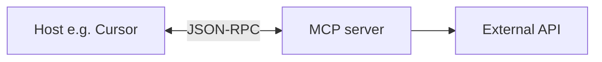

MCP の仕組み — 概要
**mcp の仕組み** について詳しく説明します。以下で焦点を絞ったメモに分割します。

## このサブメニューのマップ

|注 |フォーカス |
|------|----------|
| [JSON-RPC & トランスポート](ii-json-rpc-and-transports.md) | mcp の仕組みの一部
| [エンドツーエンドのフローと LLM](iii-end-to-end-flow-and-llm.md) | mcp の仕組みの一部
| [MCP 対コネクタとセキュリティ](iv-mcp-vs-connectors-and-security.md) | mcp の仕組みの一部
| [Vector DB、スキルとリファレンス](v-vector-db-skills-and-reference.md) | mcp の仕組みの一部
| **[カスタム MCP の作成方法](how-to-create-your-custom-mcp/i-overview.md)** |独自の MCP サーバーを計画、構築、テスト、出荷する |

MCP の仕組み
**MCP (モデル コンテキスト プロトコル)** は、**Cursor**、**Claude Desktop**、**Claude Code** などのツールを、**MCP サーバー** と呼ばれる小さな **コネクタ プログラム** を通じて **外部システム** (データベース、GitHub、Linear、Sentry) に接続する方法です。

一度設定すれば完了です。エージェントはサーバーが公開する **ツール** を呼び出します。このノートでは、**その接続がどのように機能するか** — API、gRPC などについて説明します。

## 勉強の順番

[JSON-RPC & トランスポート](ii-json-rpc-and-transports.md) → [エンドツーエンドのフローと LLM](iii-end-to-end-flow-and-llm.md) → [MCP vs コネクタとセキュリティ](iv-mcp-vs-connectors-and-security.md) → [Vector DB、スキルとリファレンス](v-vector-db-skills-and-reference.md)

**独自のビルド:** [カスタム MCP の作成方法](how-to-create-your-custom-mcp/i-overview.md) — トランスポートとエンドツーエンドのフローを理解した後。
