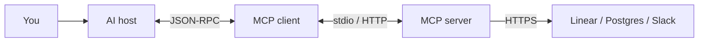

JSON-RPC とトランスポート

## 1. 一文モデル

**MCP は gRPC ではありません。** メッセージは **stdio** (ローカル) または **HTTP** (リモート) 経由で送信される **JSON-RPC 2.0** (構造化 JSON 要求/応答) です。その後、MCP サーバーは実際のシステム (通常は通常の **REST/HTTPS API**) と通信します。



＃＃２．３つの役割

|役割 |それは何ですか |例 |
|------|-----------|----------|
| **ホスト** |使用するアプリ | Cursor、クロード デスクトップ、VS コード + 拡張機能 |
| **MCP クライアント** |ホストに組み込まれています。 MCP を話します | Cursor の MCP レイヤー |
| **MCP サーバー** |インストール/構成するコネクタ |`github`、`postgres`、`@modelcontextprotocol/server-*`|

設定で**サーバー**を構成するだけです。ホストは、**クライアント**を実行します。

## 3. ワイヤ プロトコル: gRPC ではなく JSON-RPC

### JSON-RPC とは何ですか?

**JSON-RPC** は、**「この関数をリモートで実行します。引数は次のとおりです。結果を返してください」** という小さな標準的な方法で、すべてが **JSON テキスト**としてエンコードされます。

|単語 |意味 |
|-----|----------|
| **JSON** |メッセージ本文は、ログで読み取ることができるプレーンな JSON です。
| **RPC** | **リモート プロシージャ コール** — 呼び出し元は、パイプまたは HTTP 経由で関数を呼び出すなど、別のプロセスで **名前付きメソッド** を呼び出します。

これは、完全な REST API 設計ではなく、**薄い封筒** と考えてください。

```text
Request:  "Please run method X with params Y"  (one JSON object)
Response: "Here is result Z" or "Error: …"       (one JSON object)
```

これは**同じではありません**:

| | JSON-RPC (MCP ワイヤー) | REST API (線形、GitHub) |
|---|---------------------|--------------------------|
| **スタイル** |名前付き **メソッド** (`tools/call`) | **URL** + HTTP 動詞 (`GET /issues`) |
| **誰が使用しますか** | MCP **クライアント ↔ MCP サーバー** | MCP **サーバー ↔ 外部 SaaS** |
| **設定はあなたが行います** |まれに — ホストが処理します。トークン、サーバー構成のベース URL |

MCP が JSON-RPC を選択した理由は、これが **シンプル**で、**人間が判読可能**で、カスタム バイナリ プロトコルを作成することなく **stdio パイプ** (1 つの JSON ライン入力、1 つの JSON ライン出力) で動作するためです。

### リクエストとレスポンスの形状

すべてのメッセージは、いくつかの固定フィールドを持つ JSON オブジェクトです。

**リクエスト** (クライアント → サーバー):

```json
{
  "jsonrpc": "2.0",
  "id": 1,
  "method": "tools/call",
  "params": {
    "name": "search_issues",
    "arguments": { "query": "checkout bug" }
  }
}
```

|フィールド |役割 |
|------|------|
|`jsonrpc`|いつも`"2.0"`— プロトコルのバージョン |
|`id`|リクエストとレスポンスを関連付けます (リクエスト ID など)。
|`method`| **どのリモート関数**を実行するか (MCP は次のような名前を定義します)`tools/call`、`tools/list`) |
|`params`|そのメソッドの引数 |

**応答** (サーバー → クライアント) — 成功:

```json
{
  "jsonrpc": "2.0",
  "id": 1,
  "result": {
    "content": [
      { "type": "text", "text": "[{\"id\": 42, \"title\": \"Checkout timeout\"}]" }
    ]
  }
}
```

**応答** — 失敗:

```json
{
  "jsonrpc": "2.0",
  "id": 1,
  "error": {
    "code": -32603,
    "message": "Linear API rate limited"
  }
}
```

|フィールド |役割 |
|------|------|
|`result`|成功時のペイロード — MCP ツールの場合、多くの場合 **テキストまたは構造化コンテンツ** |
|`error`|失敗時のペイロード — コード + メッセージ (いいえ`result`) |

**ホスト**は JSON-RPC を MCP サーバーに送信します。 **LLM は JSON-RPC** を解析しません。ホストが抽出した**ツール結果**のみを参照します。`result`そしてチャットにドロップします。

### JSON-RPC と gRPC (MCP が gRPC を選択しなかった理由)

| | MCP (JSON-RPC) | gRPC (比較用) |
|---|----------------|--------------------------|
| **メッセージ形式** | **JSON テキスト** | Protobuf (バイナリ) |
| **一般的な輸送方法** | stdio パイプまたは **HTTP POST** | HTTP/2 |
| **人間が読める形式** |はい - ログでのデバッグが簡単です。いいえ - エンコードされたバイナリ |
| **MCP 仕様の標準** |はい | **未使用** by MCP |

モデルは生の HTTP を Linear に送信しません。 **ホスト**に MCP **ツール**を実行するよう要求します。ホストは **JSON-RPC** を MCP サーバーに送信します。サーバーはそのツールを実装し、トークンを使用して Linear の **HTTPS REST API** を呼び出すことができます。

## 4. 2 つの標準トランスポート

[MCP 仕様](https://modelcontextprotocol.io/specification/2025-06-18/basic/transports) JSON-RPC がクライアントとサーバー間を移動する方法を定義します。

### stdio (ローカル - IDE で最も一般的)

```text
Host spawns MCP server as subprocess
  Client writes JSON-RPC → server's stdin
  Server writes JSON-RPC → server's stdout
```

| | の場合に使用されます。例 |
|----------|----------|
|サーバーは **お使いのマシン上で動作します** | Cursor、クロード デスクトップのローカル構成 |
|サーバーは **スクリプトまたはバイナリ**です |`npx @modelcontextprotocol/server-filesystem`|

|長所 |短所 |
|------|------|
|単純;開いているポートがありません |サーバーはローカルにインストールする必要があります |
|ラップトップ上の秘密に最適 |構成エントリごとに 1 つのサーバー プロセス |

**Cursor`mcp.json`(概念的):**

```json
{
  "mcpServers": {
    "github": {
      "command": "npx",
      "args": ["-y", "@modelcontextprotocol/server-github"],
      "env": { "GITHUB_PERSONAL_ACCESS_TOKEN": "..." }
    }
  }
}
```

ホストがプロセスを**開始**します。通信は **パイプ** であり、URL をクリックするものではありません。

### ストリーミング可能な HTTP (リモート)

**Web サービス** (チームホスト型コネクタ、SaaS MCP) として実行されているサーバーの場合:

```text
Client → HTTP POST (JSON-RPC body) → https://your-company.com/mcp
Server → JSON response OR SSE stream (Server-Sent Events)
```

|ピース |詳細 |
|------|----------|
| **POST** |各クライアント メッセージは、1 つの **MCP エンドポイント** に対する POST にすることができます (例:`/mcp`) |
| **GET** |オプション — **SSE** ストリームを開き、サーバーが通知をプッシュできるようにします。
| **ヘッダー** |`Mcp-Protocol-Version`、`Mcp-Session-Id`バージョン管理/セッション用 |
| **認証** |通常はベアラー トークンまたは HTTPS の OAuth — 他の API と同じ |

これは **プレーン HTTP(S)** です。ロード バランサー、API ゲートウェイ、および企業プロキシは、多くの場合、gRPC サポートなしで動作します。

**古いトランスポート:** 初期の MCP は **HTTP + SSE** (2 つのエンドポイント) を使用していました。新しい実装では **Streamable HTTP** を使用する必要があります。一部のスタックは互換性のために両方をサポートしています。