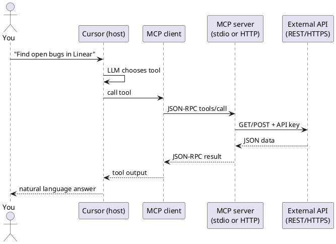
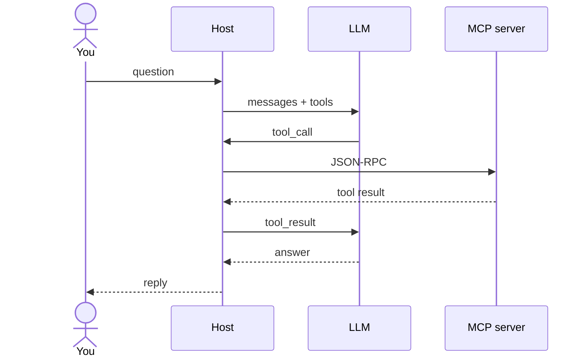
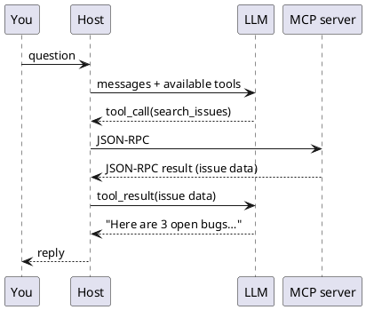

エンドツーエンドのフローと LLM

## 5. エンドツーエンドの流れ

|ステップ |プロトコル |
|------|----------|
|あなた ↔ ホスト |チャット UI |
|ホスト ↔ MCP サーバー | **JSON-RPC** stdio または HTTP 経由 |
| MCP サーバー ↔ SaaS | **その製品は API** (REST、GraphQL、SDK) |

## 6. JSON は LLM に直接接続されますか?

**ほぼですが、直接ではありません。** MCP サーバーは、中間ステップなしでモデル API に直接送信するのではなく、JSON を **ホストの MCP クライアント**に送り返します。その後、**ホスト** (Cursor、クロード デスクトップ) は**その結果を**ツール結果**としてチャット**に挿入し、**IT2__ は次のターンでそれを読み取ります**。

|ホップ |旅するもの |誰が見る |
|-----|--------------|---------------|
| MCP クライアント ↔ MCP サーバー | **JSON-RPC** (有線プロトコル) |ホストのみ — チャットには表示されません UI |
|ホスト ↔ LLM | **ツール呼び出し + ツール結果** (メッセージ内のテキスト/JSON) |モデルはそれをコンテキストとして使用します。
|ホスト ↔ あなた | **自然言語** |読んだもの |

そのとおりです。**データ** は通常 JSON (問題リスト、クエリ行、ファイルの内容) です。 LLM はそのコンテンツを **実際に** 消費しますが、**ホストを介して**、それを標準の **ツール呼び出し** ループにラップします。 LLM は、MCP サーバー自体へのソケットを開きません**。

ループは繰り返される可能性があります。LLM は、応答する前に **いくつか** MCP ツールを呼び出す可能性があります。

**表示内容:** 最後の散文 (およびおそらく UI のツール実行インジケーター)。 **表示されないもの:** ログをデバッグしない限り、クライアントとサーバー間の生の JSON-RPC。

## 7. __​​IT0__ サーバーが公開するもの

接続後、サーバーは機能をアドバタイズします。

|能力 |エージェントは… |
|-----------|-----------|
| **ツール** |関数の呼び出し (`create_issue`、`run_query`) |
| **リソース** | URIの読み取り(`file://`、`db://schema/users`) |
| **プロンプト** |事前に構築されたプロンプト テンプレートを使用する (ユーザーにとってはあまり一般的ではありません) |

**LLM** にはツール **名前と説明**が表示されます。ホストはモデルの意図を MCP **ツール呼び出し**にマッピングします。