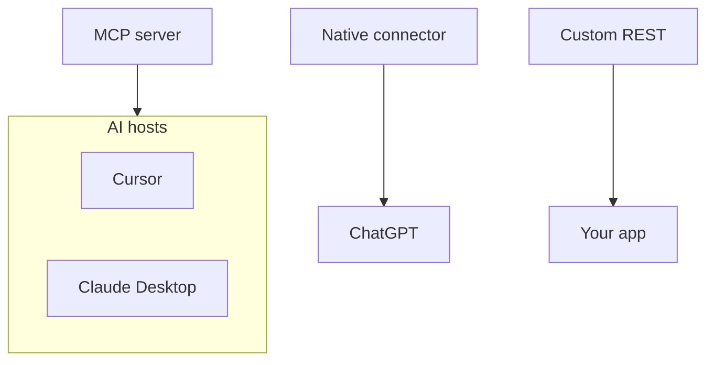

MCP 対コネクタおよびセキュリティ

## 8. MCP 対「内蔵コネクタ」対 REST

|アプローチ |誰がそれを構築するのか | AI ホストに接続する |
|----------|------|------|
| **MCP サーバー** |コミュニティまたはベンダー | JSON-RPC (stdio/HTTP) |
| **ネイティブ統合** | ChatGPT/人類/マイクロソフト |ベンダー固有の API |
| **アプリ内のカスタム REST** |あなたのバックエンド |コード — ラップしない限り MCP ではありません |

MCP の値は、多くのホストで再利用できる **1 つのコネクタ形式** です。Cursor と Claude Desktop には同じ GitHub サーバーが使用されます。

## 9. セキュリティ (ユーザーチェックリスト)

|リスク |緩和 |
|------|-----------|
| MCP サーバーには **API キー**があります |環境変数。決してトークンをコミットしないでください。回転 |
| **広範なツール** |必要なサーバーのみを有効にする |
| **リモート MCP URL** | HTTPS のみ。プロバイダーを信頼する |
| **stdio サーバーはローカルで実行されます** |設計に従ってファイル/シェルを読み取ることができます — サーバードキュメントを読む |
| **即時注入 → ツールの乱用** |範囲を制限する。エージェントのアクションを確認する ([信頼して検証する](../trust-privacy-and-verify/i-overview.md)) |

MCP は、基礎となる API の **権限モデル** を置き換えません。GitHub トークンは、引き続き GitHub が許可することのみを実行します。