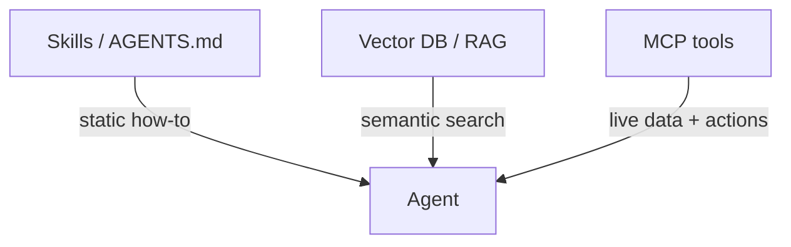
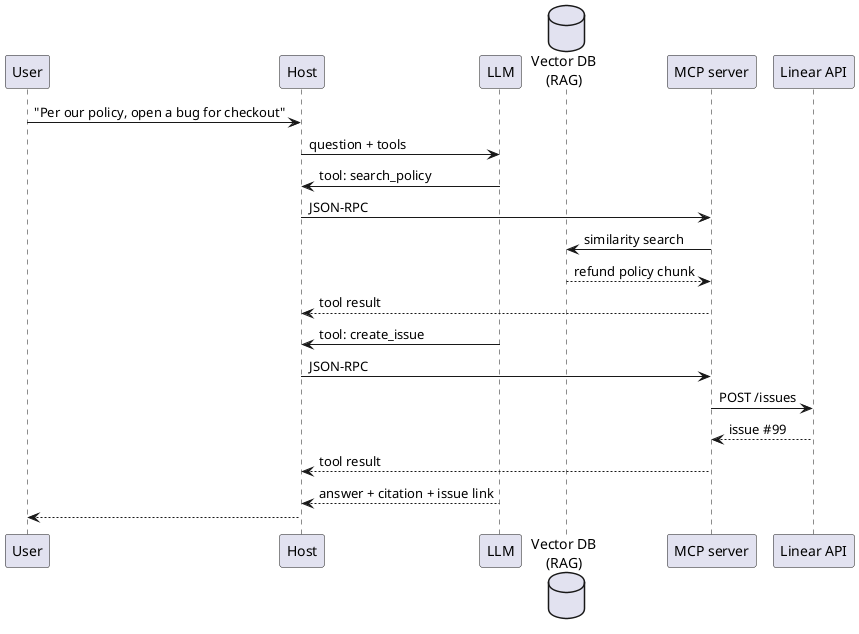

Vector DB、スキルとリファレンス

## 10. MCP 対スキル対ベクトル DB が必要な場合

これらは**さまざまな問題**を解決します。それらを組み合わせることがよくあります。



|必要 |メカニズム |例 |
|------|-----------|-----------|
| **PR レビューの書き方** | [スキル]（../skills-and-agent-instructions/i-overview.md) |静的プレイブック`SKILL.md`|
| **リポジトリのレイアウトとテスト コマンド** |`AGENTS.md`/ ルール |常にコンテキスト内のプロジェクトの事実 |
| **10,000 のサポート PDF を意味で検索** | **ベクトル DB + RAG** | 「EU の返金ポリシーは何ですか?」 |
| **リニア問題 #42 をライブで取得** | **MCP** ツール |正確な現在のチケットデータ |
| **走る`SELECT * FROM orders WHERE id = …`** | **MCP** → Postgres/SQL |類似性ではなく構造化検索 |

```text
Skills / AGENTS.md     →  always-on instructions (small, static)
Vector DB (RAG)        →  semantic search over large text corpus
MCP tools              →  live actions & exact queries (APIs, SQL, GitHub)
```

### ここでのベクトル DB とは何ですか?

**ベクター データベース** には **埋め込み** (テキストの数値表現) が保存されているため、キーワードの一致だけでなく、ユーザーの質問と **「意味が似ているチャンク」** を見つけることができます。

```text
Offline:  docs → chunk → embed → store vectors (+ metadata)
Online:   question → embed → nearest-neighbour search → top-k chunks → prompt → LLM
```

そのパターンは **[RAG](../../llms/v-rag-and-fine-tuning.md)**。ベクトル DB は **検索エンジン** です。 LLM は依然としてそれらのチャンクを使用して応答を書き込みます。

### ベクトル DB を使用する場合

|次の場合にベクトル DB を使用します。なぜ |
|---------------------|-----|
| **大量の変化するドキュメント セット** |ポリシー、マニュアル、Wiki、過去のチケット - 大きすぎてすべてのプロンプトに貼り付けることができません |
| **質問があいまい/言い換えられています** |ユーザーが「サブスクリプションをキャンセル」と言った場合。ドキュメントには「計画を終了」と書かれています - 類似性が役立ちます |
| **散文からの引用が必要です** |回答はハンドブックのセクションを引用する必要があります。
| **キーワード検索が失敗します** |同義語、タイプミス、クロスランゲージ、概念的な質問 |

### ベクトル DB が**必要ない**場合

|次の場合にベクトル DB をスキップします… |代わりに使用してください |
|---------------------|---------------|
| **小規模で固定されたコンテキスト** |スキル、`AGENTS.md`、いくつかのアップロードされたファイル (ChatGPT プロジェクト、Cursor ルール) |
| **正確な ID またはキー検索** | SQL、REST API (**MCP** 経由)`get_order`、`fetch_issue`) |
| **実際の動作状態** | 「デプロイはグリーンですか?」 → ドキュメント検索ではなく API を監視 |
| **構造化フィルター** |`status=open AND team=billing`→ k-NN ではなく、データベース クエリ |
| **リポジトリ全体がエージェント コンテキストに適合します** | IDE は、開いているファイルにインデックスを付けます。`@docs`1 つのコードベースには十分かもしれません |

### ベクトル DB が MCP を基準にして配置される場所

Vector DB は、JSON-RPC または MCP 仕様の一部ではありません**。これらは **検索の背後にある** ものであり、多くの場合、次の 2 つの方法のいずれかでアクセスされます。

**A) 製品で構築された RAG (MCP は配線しません)**

ChatGPT プロジェクト、NotebookLM、Copilot — これらは、**製品内**に分割、埋め込み、検索します。ファイルをアップロードします。ベクトル MCP は必要ありません。

**B) MCP は検索をツールとして公開します**

アプリまたはカスタム MCP サーバーはベクター ストアをラップします。

```text
LLM → host → MCP tool "search_handbook" → vector DB (similarity) → chunks → tool result → LLM
```

**ローカル スタックの例:** [TurboVec + Ollama + ローカル ファイル](../../implementation-example/vii-turbovec-ollama-local-files.md) — マネージド ベクター サービスなし。ディスク上のファイルとインデックス。

他の MCP ツールと同じ JSON-RPC パス。サーバーは embed + k-NN を実行し、テキスト チャンクを返します。

**C) バックエンドはエージェントの前に RAG を実行します**

```text
User question → your API retrieves from vector DB → builds prompt → LLM
Separate MCP tools for: create_ticket, run_sql, post_slack
```

運用環境での共通点: **RAG は知識**、**MCP はアクション**。



### クイックデシジョンツリー

```text
Is it "find relevant paragraphs in lots of text"?
  Yes → vector DB (RAG), maybe via MCP search tool
  No ↓
Is it "get this exact record / call this API now"?
  Yes → MCP tool (SQL, REST, SDK)
  No ↓
Is it "how should the agent behave"?
  Yes → skill / AGENTS.md / custom GPT instructions
```

スキル = **プレイブック**。ベクトル DB = **ドキュメント上の意味記憶**。 MCP = **システムに実際に手を入れる**。

**さらに詳しく:** [RAG と微調整](../../llms/v-rag-and-fine-tuning.md)、[カスタム アシスタントとナレッジ](../custom-assistants-and-knowledge/i-overview.md）。

## 11. クイックリファレンス

|質問 |答え |
|----------|----------|
| JSON～RPC とは何ですか? | **リモート プロシージャ コール** - JSON **params** を使用して名前付き **メソッド** を呼び出し、JSON **結果** または **エラー** を取得します。
| MCP は gRPC ですか? | **いいえ** — JSON-RPC 2.0 |
| MCP サーバーは LLM に直接応答しますか? | **いいえ** — 応答は **ホスト** に送信され、ホストは **ツールの結果** を LLM に渡します。
|ローカル Cursor MCP? |通常 **stdio** (サブプロセス) |
|ホストチーム MCP? | **ストリーミング可能な HTTP** (POST + オプションの SSE) |
|サーバーはどのようにしてリニアに到達しますか? | **HTTPS REST** (またはベンダー SDK) |
| JSON-RPC と書きますか? | **いいえ** — ホストとサーバーが処理します。
|ベクター DB が必要になるのはどのような場合ですか? | **大規模なテキスト コーパス + ファジー セマンティック検索** (RAG) — 正確な API/SQL 検索用ではありません。
| DB は MCP の一部ですか? | **いいえ** — MCP 検索ツールまたは独自の RAG アプリの背後にあるオプションの **バックエンド** |

## 12. リハーサルの質問

- JSON-RPC は何を表しますか?また、リクエストを識別する 3 つのフィールドはどれですか?
- MCP 対ベクトル DB — 「未解決のリニア問題 #42」と「払い戻しについてのハンドブックの記載」はどちらでしょうか?
- MCP クライアントとサーバーの間でメッセージを伝送するプロトコルは何ですか?
- MCP サーバーと LLM の間に誰が座りますか?
- stdio と Streamable HTTP — それぞれはいつ使用されますか?
- Linear の API 、つまり LLM または MCP サーバーを呼び出すのは誰ですか?

**関連:** [ツールとオーケストレーション](../tools-and-orchestration/i-overview.md)、[エージェントとエージェントのワークフロー](../agents-and-agentic-workflows/i-overview.md)、[スキルとエージェントの指示](../skills-and-agent-instructions/i-overview.md)、[カスタム MCP の作成方法](how-to-create-your-custom-mcp/i-overview.md)、[TurboVec + Ollama + ローカル ファイル](../../implementation-example/vii-turbovec-ollama-local-files.md）。