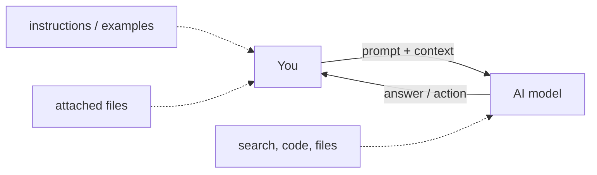

---
label: "I"
subtitle: "概要"
group: "AI Applied"
order: 1
---
AI 適用 — 概要
**使用する人向けの実用的な AI** — ChatGPT、Claude、Gemini、Copilot、Cursor、および類似のツール — モデルのトレーニングや研究論文の閲覧には使用できません。

モデルが内部でどのように機能するかについて知りたい場合は、[機械学習](../machine-learning/i-overview.md) → [ディープラーニング](../deep-learning/i-overview.md) → [LLMs](../llms/i-overview.md）。日々の業務における **アウトプット**、**ワークフロー**、**信頼** を目標とする場合は、**ここから始めてください**。

## このサブメニューのマップ

| Part | Topic |
|------|--------|
| **I — Overview** | 対象者、メンタルモデル、学習パス |
| **[Effective prompting](effective-prompting/i-overview.md)** | プロンプト構造、技法、テンプレート |
| **[Agents & agentic workflows](agents-and-agentic-workflows/i-overview.md)** | マルチステップ AI、ツール、ガードレール |
| **[Tools & orchestration](tools-and-orchestration/i-overview.md)** | チャット、IDE、自動化、MCP 入門 |
| **[Custom assistants & knowledge](custom-assistants-and-knowledge/i-overview.md)** | Projects、カスタム GPT、ユーザー向け RAG |
| **[Multimodal & files](multimodal-and-files/i-overview.md)** | PDF、画像、スプレッドシート、音声 |
| **[Trust, privacy & verify](trust-privacy-and-verify/i-overview.md)** | ハルシネーション、機密データ、検証 |
| **[Skills & agent instructions](skills-and-agent-instructions/i-overview.md)** |`SKILL.md`、ルール、`AGENTS.md`|
| **[MCP の仕組み](how-mcp-works/i-overview.md)** | JSON-RPC、stdio vs HTTP、ベクトル DB と MCP |

## メンタルモデル (ユーザービュー)

|あなたがコントロールします | AI コントロール |
|---------------|---------------|
|目標、トーン、フォーマット、例 |言葉遣いと推論（範囲内） |
|どのファイル/コンテキストを添付するか |どのツールを呼び出すか (エージェント モード) |
|いつ停止またはリダイレクトするか |複数ステップのタスクのステップ順序 |

## 誰が何を読むべきか

|あなたの仕事 | | から始める
|----------|-----------|
|ナレッジ ワーカー (PM、アナリスト、ライター) | [効果的なプロンプト](effective-prompting/i-overview.md) → [カスタムアシスタント](custom-assistants-and-knowledge/i-overview.md) |
| Cursor/Copilot を使用する開発者 | [エージェント](agents-and-agentic-workflows/i-overview.md) → [スキルと説明](skills-and-agent-instructions/i-overview.md) |
|マネージャーが AI をチームにロールアウト | [信頼とプライバシー](trust-privacy-and-verify/i-overview.md) → [カスタムアシスタント](custom-assistants-and-knowledge/i-overview.md) |
|パワー ユーザー チェーン ツール | [オーケストレーション](tools-and-orchestration/i-overview.md) → [エージェント](agents-and-agentic-workflows/i-overview.md) |

## 2024 ～ 2026 年のシフト: チャットからエージェントへ

|時代 |インタラクション |例 |
|-----|---------------|----------|
| **チャット** | 1つの質問→1つの答え | 「このメールの要約をしてください」 |
| **アシスタント** |保存された手順とファイル |クロード プロジェクト、カスタム GPT |
| **エージェント** |目標 → 多くのステップ + ツール | 「競合他社を調査し、テーブルを作成する」 |
| **オーケストレーション** |複数の AI またはオートメーションが相互に接続されている | CRM → AI まとめ → Slack |

これをビルドする必要はありません。製品は UI で公開します。明確な目標、適切なコンテキスト、検証の習慣が**必要です**。

＃＃ 次

[効果的なプロンプト](effective-prompting/i-overview.md）。

**関連:** [LLM プロンプト エンジニアリング (技術)](../llms/iv-prompt-engineering.md)、[ユーザー向けRAG](custom-assistants-and-knowledge/i-overview.md）。
