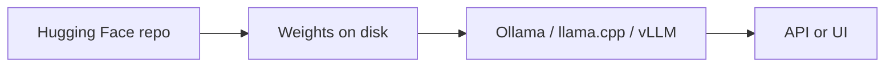

実装例 — 概要
**オープン モデルをローカルで実行する**に関する実践的なメモ — Hugging Face からのウェイトのダウンロード、ランタイムの選択、RAM のサイズ設定、および大規模な GPU がない場合の CPU 対応ランナーの使用。

このトラックは、ホスト型チャット アプリの枠を超えたい**実践者**向けです。モデルが概念的にどのように機能するかについては、[LLMs]( を参照してください)../../llms/i-overview.md）。

## このサブメニューのマップ

|注 |フォーカス |
|------|----------|
| [ハグフェイスからダウンロード](ii-downloading-from-huggingface.md) | CLI、Git LFS、認証、および実際に得られるもの |
| [ローカル実行プラットフォーム](iii-local-run-platforms.md) | Ollama、llama.cpp、LM Studio、vLLM など — 長所と短所 |
| [モデル RAM の要件](iv-model-ram-requirements.md) |量子化、コンテキストの長さ、およびサイジング テーブル |
| [CPU と軽量ランナー](v-cpu-and-lightweight-runners.md) | airLLM、llama.cpp CPU、MLX、およびトレードオフ |
| [RTX 1080 にインストールして実行](vi-install-and-run-rtx-1080.md) |プラットフォームごとのインストール、GPU 検証、および 8 GB VRAM のモデル選択 |
| [TurboVec + Ollama + ローカル ファイル](vii-turbovec-ollama-local-files.md) |ローカル RAG — ファイル、圧縮ベクトル、クラウドなしのインデックス作成 |
| [Ollama](../ollama/i-overview.md) |完全な Ollama トラック — トラブルシューティングを通じてインストール |

## メンタルモデル

|ステップ |あなたが決める |
|------|-----------|
| **モデル** |サイズ、ライセンス、チャットとコード、量子化 (Q4、Q8、…) |
| **ランタイム** |使いやすさ、スループット、GPU 要件 |
| **ハードウェア** |重みの RAM + キャッシュの KV。 GPU を使用する場合は VRAM |

**デフォルトのコーディング選択:** **Qwen2.5-Coder 7B** (`ollama pull qwen2.5-coder:7b`) — オープンライセンス、HF ゲートなし、8 つの GB GPU に適合します。 [ハグフェイスからダウンロードする](ii-downloading-from-huggingface.md）。

## 勉強の順番

[ハグフェイスからダウンロード](ii-downloading-from-huggingface.md) → [ローカル実行プラットフォーム](iii-local-run-platforms.md) → [モデル RAM の要件](iv-model-ram-requirements.md) → [CPU & 軽量ランナー](v-cpu-and-lightweight-runners.md) → [RTX 1080 にインストールして実行](vi-install-and-run-rtx-1080.md) → [TurboVec + Ollama + ローカル ファイル](vii-turbovec-ollama-local-files.md）

## ローカルで実行する場合と API を使用する場合

|ローカルで実行 |ホストされた API を使用する |
|-----------|------|
|データはマシン上に保存する必要があります |最新のフロンティアモデルが欲しい |
|大量生産時の予測可能なコスト | GPU/RAM を管理する必要がない |
|オフラインまたはエアギャップ |セットアップに必要な時間は最小限です |
|微調整またはニッチなオープンウェイト |コンプライアンスによりクラウド推論が可能 |
