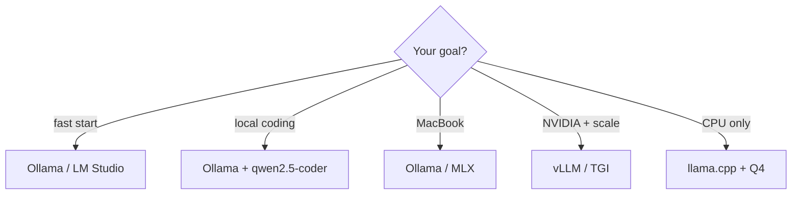

ローカル実行プラットフォーム

重みがディスク上に置かれた後、**ランタイム** がそれらをロードし、チャット (CLI、デスクトップ アプリ、または HTTP API) を公開します。ハードウェア、スループット、および許容できるセットアップの量に基づいて選択してください。

## 1. プラットフォームの比較

|プラットフォーム |こんな方に最適 | GPU | CPU | API |長所 |短所 |
|----------|----------|-----|-----|-----|------|------|
| **[Ollama](https://ollama.com)** |高速ローカル起動、開発マシン |はい (CUDA/メタル) |はい (遅い) | OpenAI互換`/v1`| 1つのコマンド`ollama pull`;クロスプラットフォーム。単純な UI |チューニングノブの数が減りました。モデルカタログを厳選 |

詳細: [Ollama トラック](../ollama/i-overview.md）。
| **[ラマ.cpp](https://github.com/ggerganov/llama.cpp)** (`llama-server`) |最大限の制御、GGUF エコシステム |はい | **強い** | HTTP サーバー内蔵 |巨大なクオンツコミュニティ。 RAM オプションが低い。埋め込み可能 | CLI-最初;モデル/パスを管理する |
| **[LM スタジオ](https://lmstudio.ai)** |デスクトップ ユーザー、実験 |はい |はい |ローカルサーバー | GUI 検索/ダウンロード/チャット用。簡単な GPU オフロード スライダー |デスクトップのみ。ヘッドレスサーバーにはあまり適さない |
| **[vLLM](https://github.com/vllm-project/vllm)** |本番 GPU の提供、バッチ処理 | **必須** (NVIDIA) |いいえ | OpenAI 互換 |高スループット。ページ化された注意;マルチGPU |重いセットアップ。 Linux + 最近の GPU が必要 |
| **[TGI](https://github.com/huggingface/text-generation-inference)** (HF) | HF-ネイティブ GPU デプロイ | **必須** |いいえ | REST / gRPC |優れた HF 統合。生産機能 |意見の多いスタック。 GPU 中心 |
| **[TensorRT-LLM](https://github.com/NVIDIA/TensorRT-LLM)** | NVIDIA 最大パフォーマンス | **必須** (NVIDIA) |いいえ |カスタム / トリトン |サポートされている GPU で最速 |複雑な構造。 NVIDIA-のみ |
| **[MLX](https://github.com/ml-explore/mlx)** | Apple Silicon Mac |金属 | N/A (アップル GPU) | Python / ローカル | M-シリーズ用に最適化されています。 Mac での低摩擦 | Apple ハードウェアのみ |
| **[GPT4すべて](https://gpt4all.io)** |オフラインデスクトップ、低スペック |オプション | **はい** |ローカル API |とても親しみやすい。バンドルモデル |小規模なモデルの選択;ハッキング可能性が低い |
| **[コボルドCPP](https://github.com/LostRuins/koboldcpp)** |クリエイティブ ライティング、単一バイナリ |はい |はい |ウェブ UI + API |ポータブル;ストーリーモードの機能 |ニッチ UI; Ollama よりも小さなコミュニティ |

## 2. 意思決定のショートカット



## 3. フォーマットの互換性

|ランタイム |一般的な重みの形式 |
|----------|-----------|
| Ollama | Ollama バンドル (モデルファイル) またはインポート GGUF |
| llama.cpp / LM スタジオ / コボルドCPP | **GGUF** |
| vLLM / TGI / トランス | **セーフテンサー**、AWQ、GPTQ、FP8 |
| MLX | MLX で変換された重み (多くの場合、HF からリンクされます) |

間違った形式をダウンロードすると、変換または再ダウンロードが必要になります。[Hugging Face からのダウンロード]( を参照)ii-downloading-from-huggingface.md）。

## 4. API 形状 (統合)

ほとんどのローカル スタックは **OpenAI 互換** HTTP API を公開しているため、既存のクライアントは動作します。

```bash
# Ollama + Qwen2.5-Coder (coding)
curl http://localhost:11434/v1/chat/completions \
  -H "Content-Type: application/json" \
  -d '{"model":"qwen2.5-coder:7b","messages":[{"role":"user","content":"Write a Python fib function"}]}'
```

|プラットフォーム |デフォルトのベース URL |
|----------|------|
| Ollama |`http://localhost:11434/v1`|
|ラマサーバー |`http://localhost:8080`(構成可能) |
| LM スタジオ |`http://localhost:1234/v1`|
| vLLM |`http://localhost:8000/v1`|

サーバーが認証を強制しない場合は、Cursor、Continue、またはダミーの API キーを使用してアプリをその URL に向けます。コーディングの場合、モデルを ** に設定します`qwen2.5-coder:7b`** (8 GB GPU) または **`qwen2.5-coder:32b`** (24 GB+ GPU)。

## 5. 推奨コーディング モデル — Qwen2.5-Coder

|サイズ | Ollama タグ | VRAM (Q4、~4,000 ctx) |こんな方に最適 |
|-----|----------|----------|----------|
| 1.5B |`qwen2.5-coder:1.5b`| ~2 GB |オートコンプリート / より大きなチャット モデルと組み合わせ |
| 3B |`qwen2.5-coder:3b`| ~2.5 GB |タイトな GPU の高速編集 |
| **7B** | **`qwen2.5-coder:7b`** | **~5 GB** | **RTX 1080 / 8 GB カードのデフォルト** |
| 14B |`qwen2.5-coder:14b`| ~9 GB | 12–16 GB VRAM |
| 32B |`qwen2.5-coder:32b`| ~20 GB | 24 GB VRAM — ファミリー内で最強のオープンコーダー |

Apache 2.0 ライセンス。 HF からのダウンロードにはメタスタイル ゲートは必要ありません**。 [ハグフェイスからダウンロードする](ii-downloading-from-huggingface.md）。

## 6. ローカルサーバーのセキュリティ

|リスク |緩和 |
|------|-----------|
| LAN のポートを開く |バインド先`127.0.0.1`リモート アクセスを意図しない場合のみ |
|認証なし |暴露しないでください`:11434`または`:8080`インターネットに生で |
|モデルライセンス |ローカル実行では HF またはメタ ライセンス条項がバイパスされません。

＃＃ 次

[モデル RAM の要件](iv-model-ram-requirements.md) — クォントとコンテキストの長さを選択する前に、マシンに合わせてモデルのサイズを決定します。

**ハンズオン:** [RTX 1080 にインストールして実行](vi-install-and-run-rtx-1080.md) — 8 GB Pascal GPU のプラットフォームごとのセットアップ。
