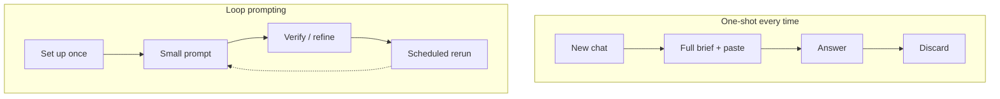

ループプロンプト — 概要
**ループ プロンプト**は、**毎回ゼロから再開**するのではなく、**サイクル**で AI で動作します。永続的な指示とコンテキストに一度投資すると、各ターンは小さな修正またはトリガーになり、別の完全な概要ではなくなります。

これは [効果的なプロンプト](../effective-prompting/i-overview.md) (適切なプロンプトの書き方) および [エージェント](../agents-and-agentic-workflows/i-overview.md) (マルチステップツールの使用)。ループ プロンプトは **習慣層** です。モデルがすでに知っているはずのことを再説明するのはやめてください。

## このサブメニューのマップ

|注 |フォーカス |
|------|----------|
| [ワンショット vs ループ](ii-one-shot-vs-loop.md) |古いチャット習慣と一度設定すれば何度も繰り返す習慣 |
| [永続的な指示](iii-persistent-instructions.md) |プロジェクト、スキル、ルール、保存されたシステム コンテキスト |
| [セッションと繰り返しループ](iv-session-and-recurring-loops.md) |同一スレッドの改良、`/loop`、自動化 |
| [衛生状態とリセット時期](v-hygiene-and-when-to-reset.md) |コンテキストの腐敗、古くなったスキル、信頼境界 |

## 1. 2種類のループ

|ループタイプ |あなたはそうします |例 |
|----------|----------|----------|
| **人間参加型** |セッションまたはプロジェクトを 1 つだけ保持します。ショートデルタを送信 | 「イントロが短い。」 「表2を修正してください。」 「もう一度テストを実行してください。」 |
| **時間/イベントループ** |繰り返しトリガーまたはウォッチャー トリガーを準備する | Cursor`/loop 5m check CI`、ウォッチャーのデプロイ、毎週のダイジェスト自動化 |

どちらも、同じプリアンブルを新しいチャットに貼り付けるのではなく、**保存されたコンテキスト**を再利用します。

## 2. メンタルモデル

|レイヤー |何が続くのか |場所 (例) |
|------|------|------|
| **アイデンティティと基準** |トーン、フォーマット、チームルール |カスタム GPT、クロード プロジェクト、`.cursor/rules`|
| **ワークフロー** |複数ステップのハウツー |`SKILL.md`、保存されたプロンプト ライブラリ |
| **レポート/ナレッジ** |モデルが参照すべきファイル |プロジェクト ファイル、RAG、`@folder`Cursor で |
| **セッション状態** |現在進行中の成果物 |同じチャット スレッド、エージェントのトランスクリプト |

＃＃３．これを読むべき人

|あなたは… | | から始める
|------|-----------|
|毎日同じ指示を再入力する | [永続的な指示](iii-persistent-instructions.md) |
|多くの「再試行」メッセージに基づいて下書きを調整する | [ワンショット vs ループ](ii-one-shot-vs-loop.md) |
|毎回尋ねずに CI またはデプロイをチェックしてほしい | [セッションと繰り返しループ](iv-session-and-recurring-loops.md) |
| Cursor または IDE エージェントを多用する |このトラック → [スキルとエージェントの説明](../skills-and-agent-instructions/i-overview.md) |

＃＃４．勉強の順番

[ワンショット vs ループ](ii-one-shot-vs-loop.md) → [永続的な指示](iii-persistent-instructions.md) → [セッションと繰り返しループ](iv-session-and-recurring-loops.md) → [衛生状態とリセット時期](v-hygiene-and-when-to-reset.md）

## 5. リハーサルの質問

- 人間参加型ループと時間/イベント ループの違いは何ですか?
- 永続命令が存在する場所を 2 つ挙げてください。
- 新しいチャットを選択するのが依然として正しいのはどのような場合ですか?

**次:** [ワンショット vs ループ](ii-one-shot-vs-loop.md）。
