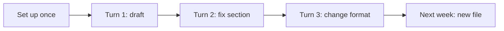

ワンショット vs ループ
**ワンショット プロンプト** では、すべてのチャットが白紙の状態のように扱われます。 **ループ プロンプト**は、ブリーフィングの大部分がすでに耐久性のある場所に存在していることを前提としています。各ターンの仕事は**説明**ではなく、**舵取り**です。

## 1. 単発の癖（今でもよくある）

```text
Open new chat
  → paste role paragraph
  → paste constraints
  → attach files
  → ask task
  → get answer
  → tomorrow: repeat everything
```

|コスト |詳細 |
|------|----------|
| **時間** |セッションごとのセットアップ時間 (分) |
| **品質のドリフト** |昨日の言葉遣い≠今日の言葉遣い |
| **失われたイテレーション** |古いスレッドに閉じ込められた優れた改良点 |
| **トークンの無駄** |すべてのメッセージを同じコンテキストで再送信する |

**本当に斬新な**タスクの場合は、ワンショットで十分です。 **定期的な**作業 (週次レポート、PR レビュー、サポートへの返信、ドキュメントの編集) にはコストがかかります。

## 2. ループ癖



各ターンは **デルタ** (修正、新しい添付ファイル、または変更された入力) であり、再構築されたシステム プロンプトではありません。

## 3. 並列

|寸法 |ワンショット |ループ |
|----------|----------|------|
| **セッションごとのセットアップ** |完全なプロンプト |ほとんどはすでに保存されています |
| **一般的なメッセージの長さ** |ロング |短い |
| **コンテキストの場所** |チャットのみ |プロジェクト + チャット |
| **こんな用途に最適** |一回限りの高感度分離 |同じ標準でワークフローを繰り返す |
| **障害モード** |一貫性のない出力 |保存されたコンテキストが古いか間違っている |

## 4. 反復ループ (人間)

[効果的なプロンプト — 反復] より(../effective-prompting/iii-iteration-and-templates.md)、アップグレードされました:

```text
1. Rough ask (context already loaded)
2. Specific fix (“table 2 wrong source”)
3. One constraint per turn
4. Save what worked → skill or template (not just chat history)
```

**ループ ルール:** 今週同じ段落を 2 回入力した場合、**それを永続的な命令に昇格**します。[永続的な命令]( を参照)iii-persistent-instructions.md）。

## 5. ループは「決して新しく始めない」わけではありません

| **新しい**チャットを開始するには… | **ループを続行**する場合… |
|----------------------------|----------------------------|
|トピックや対象者が完全に変わった |同じ成果物またはワークフロー |
|コンテキストは間違った仮定によって汚染されています。出力品質を洗練する |
|隔離が必要です (機密取り違え) |エージェントはすでに正しいファイルを読み取っています |
|モデルが悪いパターンにはまってしまう |小規模な直接修正が機能する |

## 6. エージェントとの関係

| |ループプロンプト |エージェント |
|---|----------------|--------|
| **焦点** |反省しないでください。安価に反復する |目標に向けた多くのステップとツール |
| **あなたの意見** |ショートステアリング |目標 + 境界線 + チェックポイント |
| **オーバーラップ** |コンテキストが持続する場合、エージェント セッションは「ループ」になります。エージェントは保存されたスキル/ルールから恩恵を受ける |

[エージェント — 概要](../agents-and-agentic-workflows/i-overview.md) 工具を大量に使用する複数のステップの作業に適しています。 **毎日**ステアリングを繰り返す場合は、ループ プロンプトを使用します。

## 7. リハーサルの質問

- ワンショットプロンプトがトークンを無駄にするのはなぜですか?
- ループ内の優れた「デルタ」メッセージとは何ですか?
- 新しいチャットはいつ開くべきですか?

**次へ:** [永続的な指示](iii-persistent-instructions.md）。
