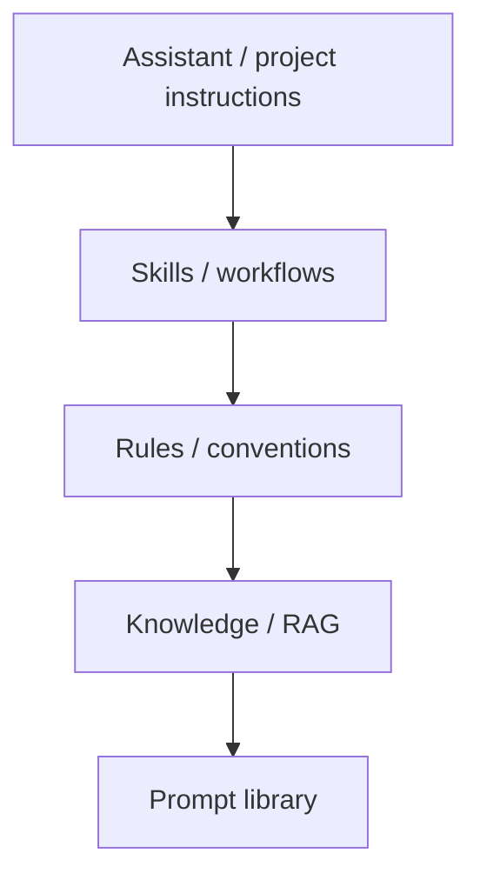

永続的な指示
**永続的な指示** は「繰り返してはいけないプロンプト」であり、製品が適用されると判断したときに自動的に読み込まれます。このレイヤーを一度構築します。毎日のループが短いコマンドになります。

## 1. スタック (ツールがサポートするものを選択してください)



|レイヤー | ChatGPT / クロード | Cursor / IDE |
|------|---------------|--------------|
| **プロジェクト / カスタム GPT** |手順 + アップロードされたファイル |ルール、`AGENTS.md`、インデックス |
| **ワークフロー** |カスタム GPT アクション、プロジェクト |`SKILL.md`|
| **知識** |プロジェクトの知識、RAG |`@`メンション、コードベースのインデックス |

詳細: [カスタム アシスタント](../custom-assistants-and-knowledge/i-overview.md)、[スキルとエージェントの指示](../skills-and-agent-instructions/i-overview.md）。

## 2. 永続層に属するもの

|永続的に保存 |メッセージごとに保持する |
|-----------------|-----------------|
|役割、口調、聴衆 |今日のデータ、一度限りの事実 |
|出力形式のデフォルト | 「火曜日の番号のみを使用してください」 |
|チームの名前付け、スタック、テスト コマンド | 「ステップ 2 の後で停止」 |
|検証の習慣 (「出典を引用」) |このターンの特定のファイル パス |
|あなたが毎週言うこと |このドラフトの新しい制約 |

**ルール:****3 回**送信した場合は、外部化します。

## 3. クロード プロジェクト / ChatGPT カスタム GPTs

|フィールド |使用を促すループ |
|------|---------------------|
| **指示** |安定したペルソナ + 品質バー |
| **ナレッジ ファイル** |方針、用語集、過去の事例 |
| **会話** |プロジェクト内の短いデルタ |

```text
Project: “Acme PM assistant”
  Instructions: bullet memos, flag risks, never invent dates
  Files: roadmap.pdf, style-guide.md
  Loop message: “Summarise this Slack export for exec standup.”
```

来週も同じプロジェクト - エクスポートを交換するだけです。

## 4. Cursor: ルール、スキル、AGENTS.md

|アーティファクト | | のときにロードされます。コンテンツ例 |
|----------|-----------|------|
| **`.cursor/rules/*.mdc`** |ファイル パターンまたは常に | TypeScript エラー処理 |
| **`SKILL.md`** |タスクは説明と一致します | 「スモークテストの実行方法」 |
| **`AGENTS.md`** |エージェントがリポジトリを開きます |テスト コマンド、フォルダー マップ |

**「この PR を確認してください」** と言います — ルールはスタイルを強制し、スキルはチェックリストを定義します。`AGENTS.md`テストの実行方法を説明します。チャットボックスにエッセイはありません。

[Cursor スキル、ルール、AGENTS.md](を参照)../skills-and-agent-instructions/iv-cursor-skills-rules-agents-md.md）。

## 5. プロンプトライブラリ (軽量永続性)

すべてにカスタム GPT が必要なわけではありません。 **個人ライブラリ**は機能します:

```text
prompts/
  weekly-status.md      # role + format + “paste updates below”
  client-email.md
  code-review-delta.md  # “checklist already in SKILL; paste diff”
```

ループ = **既に命令が含まれているプロジェクト**でテンプレートを開き、変数部分のみを貼り付けます。

## 6. プロモーションのワークフロー

ワンショット チャットがうまくいった場合:

```text
1. Highlight reusable blocks (role, format, checks)
2. Move to project instructions or SKILL.md
3. Replace long text with a name: “Use weekly-status template”
4. Delete duplicate paragraphs from old chats
5. Test one short prompt — does quality hold?
```

## 7. アンチパターン

|間違い |修正 |
|----------|-----|
| Wiki 全体を手順にダンプする |リンクまたは RAG;指示をスキャンできるようにしておきます。
| 5 か所でルールが重複しています |真実の情報源が 1 つあります。からのリンク`AGENTS.md`|
|プロセス変更後は更新しない |スキルを四半期ごとにレビューする |
|説明書の秘密 |決して使用しないでください - 環境変数と編集された例を使用してください。

## 8. リハーサルの質問

- Cursor に永続的な命令を保存する 3 つのアーティファクトに名前を付けます。
- プロジェクトの指示に移すのではなく、メッセージに何を残す必要がありますか?
――「3倍」昇格ルールとは何ですか？

**次:** [セッションと繰り返しループ](iv-session-and-recurring-loops.md）。
