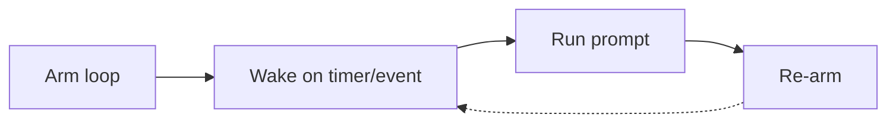

セッションと繰り返しループ
保存された指示を超えて、**1 つのセッション内でループ** (同じ作業を調整) したり、**スケジュール/イベントでループ** (新しいチャットを開かずに再実行) することができます。どちらもループ プロンプトであり、トリガーが異なります。

## 1. セッションループ (同じスレッド)

```text
Turn 1: produce draft
Turn 2: fix specific section
Turn 3: change format
Turn 4: verify against source
```

|練習 |なぜ |
|----------|-----|
|以前の出力を参照 (「セクション 2 のみ」) |モデルはスレッド コンテキストを使用します。
|メッセージごとに 1 つの変更 |精神的に元に戻すのが簡単 |
|ファイルをピン留めする`@`IDE で |コンテキストは接続されたままになります |
|休憩前に「停止して状態を要約する」と言います |より簡単な履歴書 |

**後で再開:** ツールが履歴を保持している場合は同じプロジェクト/スレッド。それ以外の場合は、スレッド全体ではなく、**状態の概要** + 最後の良好な成果物を貼り付けてください。

## 2. 繰り返しループ (時間ベース)

**Cursor`/loop`** は一定の間隔でプロンプトを実行します。タスクを一度定義すると、エージェントはスケジュールに従って再実行されます。

```text
/loop 5m check if main CI is green; if failed paste last error
/loop 30s watch deploy log until "healthy" or 10 min timeout
/loop 1d summarize overnight Sentry errors
```

|パターン |使用 |
|----------|-----|
| **固定間隔** | CI、受信トレイ、メトリクス ダッシュボードをポーリング |
| **動的間隔** |エージェントは各実行後に次の遅延を選択します (忙しいか静かか) |
| **すぐに 1 回実行します** |最初のティックを待つ前に設定を確認してください |

構文は製品によって異なります。このアイデアは普遍的です。停止するまで**腕を立てる→目覚める→行動する→再び腕を立てる**。



## 3. イベント駆動型ループ (ウォッチャー)

ブラインド ポーリングの代わりに、**変化**があったときに起動します。

```text
Watch: git branch updates, log line matches, file saved, webhook fires
  → run prompt
  → optional fallback heartbeat if no event
```

|イベント |プロンプトの例 |
|------|----------------|
| PR がオープンしました | 「差分をレビューします。コメントチェックリストのみ」 |
|ビルドに失敗しました | 「ログを解析し、修正を提案し、ドキュメントをリンクする」 |
|フォルダー内の新しい CSV | 「先週の金曜日と同じ週次レポートのテンプレート」 |

イベント ループはノイズを低減します。`sleep 30s`永遠に。

## 4. 自動化プラットフォーム (IDE なし)

Cursor の外側でも同じループ形状:

```text
Trigger (schedule / form / webhook)
  → AI step (summarise, classify, draft)
  → Action (Notion, Slack, email)
  → (optional) human approval gate
```

|プラットフォーム |良いこと |
|----------|----------|
| **ザピア / メイク** | SaaS 接着剤、非開発者 |
| **n8n** |自己ホスト型の複雑なブランチ |
| **GitHub アクション + AI** | CI-リポジトリ イベントの隣接ループ |

[オーケストレーション パターン](../tools-and-orchestration/iii-orchestration-patterns.md）。顧客向けの送信の前に**承認**を行ってください。

## 5. 優れたループ プロンプトを設計する

定期的なプロンプトは各ティックごとに**自己完結型**である必要があります。モデルは昨日のことを覚えていない可能性があります。

|すべての実行を含める |省略 (別の場所に保存) |
|---------------------|--------------------------|
|何を確認するか/読んでください |長いスタイルガイド → スキル |
|合格/不合格の基準 |完全なリポジトリマップ →`AGENTS.md`|
|出力形式 |必要な場合を除き、歴史的背景 |
|停止条件 | 「役に立ちなさい」綿毛 |

```text
Loop: Every 5m
Task: Read CI status for branch main.
If green: reply "OK" only.
If red: paste failing job name + last 20 log lines + one-line likely cause.
Do not fix code unless I say FIX.
```

## 6. 停止と監視

|リスク |緩和 |
|------|-----------|
|ランナウェイポーリング/コスト |最大持続時間。指数バックオフ |
|間違った「修正」を繰り返す |ループ = レポートのみ。個別の FIX コマンド |
|アラート疲労 |状態**変更**時にのみ通知 |
|タスク完了後の古いループ |明示的な「ループ停止」またはコマンドの強制終了 |

**制作の編集、電子メールの送信、またはお金の支出を行うループの **人間参加型**。

## 7. ループとエージェントの実行

| |セッションリファインループ |繰り返し発生する`/loop`|
|---|---------------------|--------|
| **トリガー** |次のメッセージを送信します |タイマーまたはイベント |
| **範囲** | 1 つの成果物 |監視・バッチ |
| **コンテキスト** |スレッド履歴 |各ティックを新たに読み取り |
| **最高** |ライティング、コーディング、分析 |オペレーション、CI、ダイジェスト |

完全な **エージェント** は、トリガーされた 1 つの実行内でツールを組み合わせます — [エージェントの指示](../agents-and-agentic-workflows/iii-directing-agents.md）。

## 8. リハーサルの質問

- セッション ループは時間ベースのループとどう違うのですか?
- 繰り返しのプロンプトがティックごとに自己完結型である必要があるのはなぜですか?
- CI 監視ループに追加する停止条件を 1 つ挙げてください。

**次へ:** [衛生状態とリセット時期](v-hygiene-and-when-to-reset.md）。
