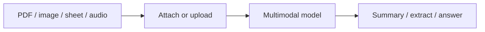

マルチモーダルとファイル — 概要
**マルチモーダルとファイル** について詳しく説明します。以下で焦点を絞ったメモに分割します。

## このサブメニューのマップ

|注 |フォーカス |
|------|----------|
| [PDF とドキュメント](ii-pdfs-and-documents.md) |マルチモーダル & ファイル トラックの一部 |
| [画像、スプレッドシート、データ](iii-images-spreadsheets-data.md) |マルチモーダル & ファイル トラックの一部 |
| [音声、コード、制限](iv-voice-code-and-limits.md) |マルチモーダル & ファイル トラックの一部 |

マルチモーダルとファイル
最新の AI ツールは、入力されたプロンプトだけでなく、**画像**、**PDF**、**スプレッドシート**、**オーディオ**、**スクリーンショット**を受け入れます。ファイルを使用することは、コンテンツを再入力するよりもはるかに優れています。

## 勉強の順番

[PDF とドキュメント](ii-pdfs-and-documents.md) → [画像、スプレッドシート、データ](iii-images-spreadsheets-data.md) → [音声、コード、制限](iv-voice-code-and-limits.md）
