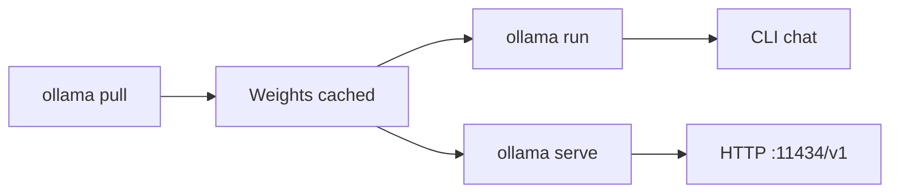

Ollama — 概要

**[Ollama](https://ollama.com)** ローカルで open LLMs を実行します — 1 回のインストール、`ollama pull`、ターミナル内、または OpenAI 互換の API 経由でチャットします。ハグフェイス ゲートや手動 GGUF パスを使用しない **Cursor** を使用した **ローカル コーディング、**オフライン チャット**、**簡単な実験**に最適な最初の選択肢です。

Ollama と llama.cpp / vLLM の比較については、[ローカル実行プラットフォーム](../implementation-example/iii-local-run-platforms.md）。 RAM/VRAM のサイズ設定については、[モデル RAM の要件](../implementation-example/iv-model-ram-requirements.md）。

## このサブメニューのマップ

|注 |フォーカス |
|------|----------|
| [インストールとセットアップ](ii-install-and-setup.md) | Linux、macOS、Windows。インストールを確認する |
| [モデル — プルと管理](iii-models-pull-and-manage.md) |`pull`、`list`、`rm`、タグ、埋め込み |
| [実行、チャット、パラメータ](iv-run-chat-and-parameters.md) |`ollama run`、`/set`、コンテキスト、システム プロンプト |
| [API と IDE の統合](v-api-and-ide-integration.md) |`/v1`API、Cursor、続行、環境変数 |
| [モデルファイルとカスタム GGUF](vi-modelfile-and-custom-gguf.md) | HF の重みをインポートします。`ollama create`|
| [GPU とトラブルシューティング](vii-gpu-troubleshooting.md) |`ollama ps`、CPU のみの修正、OOM |

## メンタルモデル



|ピース |あなたがコントロールします | Ollama ハンドル |
|------|---------------|----------------|
| **どのモデル** |`ollama pull qwen2.5-coder:7b`|ダウンロード、デフォルトのクォント |
| **GPU 対 CPU** |モデルのサイズ。環境変数 | llama.cpp バックエンド、オフロード |
| **IDE アクセス** | Cursor をポイントします`localhost:11434/v1`|チャット補完を提供します |
| **カスタムモデル** |`Modelfile`+`ollama create`|バンドル GGUF + params |

## 推奨モデル (2025 ～ 2026 年)

|使用例 |モデルタグ | VRAM (おおよそ) |
|----------|-----------|------|
| **ローカルコーディング** |`qwen2.5-coder:7b`| ~5 GB |
|一般チャット 7B |`qwen2.5:7b`| ~5 GB |
|高速/小型 GPU |`qwen2.5-coder:3b`、`llama3.2:3b`| ~2–3 GB |
|埋め込み (RAG) |`nomic-embed-text`|小 |
|最優秀オープンコーダー (24 GB+) |`qwen2.5-coder:32b`| ~20 GB |

8 GB GPU (例: RTX 1080): ** で始まる`qwen2.5-coder:7b`**。詳細: [RTX 1080 にインストールして実行](../implementation-example/vi-install-and-run-rtx-1080.md）。

## 勉強の順番

[インストールとセットアップ](ii-install-and-setup.md) → [モデル — プルと管理](iii-models-pull-and-manage.md) → [実行、チャット、パラメータ](iv-run-chat-and-parameters.md) → [API と IDE の統合](v-api-and-ide-integration.md) → [モデルファイルとカスタム GGUF](vi-modelfile-and-custom-gguf.md) → [GPU とトラブルシューティング](vii-gpu-troubleshooting.md）

## ここから始めます (5 分)

```bash
curl -fsSL https://ollama.com/install.sh | sh
ollama pull qwen2.5-coder:7b
ollama run qwen2.5-coder:7b
```

メッセージを入力します。`/bye`終了します。次: Cursor に接続します — [API と IDE の統合](v-api-and-ide-integration.md）。

＃＃ 関連している

- [TurboVec + Ollama + ローカル ファイル](../implementation-example/vii-turbovec-ollama-local-files.md) — RAG をドキュメント上で確認
- [ハグフェイスからダウンロード](../implementation-example/ii-downloading-from-huggingface.md) — 重みが必要な場合、Ollama はカタログ化されません
