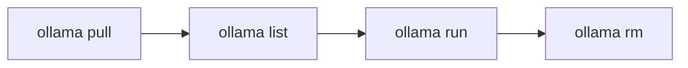

モデル — プルと管理

モデルは **タグ** (`model:variant`）。 Ollama は最初に重みをダウンロードします`pull`そしてそれらをローカルにキャッシュします。



## 1. プルモデル

```bash
# Coding (recommended default)
ollama pull qwen2.5-coder:7b

# General chat
ollama pull qwen2.5:7b
ollama pull llama3.2:3b

# Embeddings (for RAG with Ollama)
ollama pull nomic-embed-text
```

進行状況にはダウンロード サイズが表示されます。中断された場合は自動的に再開されます。

## 2. リストと検査

```bash
ollama list
ollama show qwen2.5-coder:7b
ollama show qwen2.5-coder:7b --modelfile
```

`show`パラメータ、テンプレート、ライセンス スニペットを出力します。

## 3. モデルを削除します (空きディスク)

```bash
ollama rm qwen2.5:7b
ollama rm model-name:tag
```

最初にリストします — BLOB は、モデルが参照しない限り削除されません。

## 4. タグの命名

|パターン |意味 |
|----------|----------|
|`llama3.2`|そのファミリーのデフォルトのバリアント |
|`llama3.2:3b`|特定のサイズ |
|`qwen2.5-coder:7b`|家族 + サイズ |
|`@sha256:…`|正確な BLOB をピン留めする (上級) |

カタログを参照: [ollama.com/library](https://ollama.com/library）

## 5. ハードウェアによるモデルの選択

| VRAM |推奨タグ |
|------|----------------|
| **8 GB** |`qwen2.5-coder:7b`、`llama3.2:3b`、`qwen2.5:7b`|
| **16 GB** |上記+`qwen2.5-coder:14b`(きついかもしれません) |
| **24 GB+** |`qwen2.5-coder:32b`、`llama3.1:70b`(量子化) |
| **CPU のみ** |`llama3.2:1b`、`qwen2.5-coder:3b`|

[モデル RAM の要件](../implementation-example/iv-model-ram-requirements.md）理論的には。

## 6. モデルの埋め込み

ローカル RAG の場合 (LlamaIndex などを使用):

```bash
ollama pull nomic-embed-text
ollama pull mxbai-embed-large
```

アプリへの埋め込みとチャットには、**同じ** Ollama ベース URL を使用します。ウォークスルー: [TurboVec + Ollama + ローカル ファイル](../implementation-example/vii-turbovec-ollama-local-files.md）。

## 7. ハグフェイス vs Ollama ライブラリ

|出典 |いつ |
|------|------|
| **`ollama pull`** |モデルは Ollama ライブラリにあります — 最速 |
| **モデルファイル + GGUF** |ダウンロードしたのは、`.gguf`HF から — [モデルファイルとカスタム GGUF]( を参照)vi-modelfile-and-custom-gguf.md) |
| **完全な HF セーフテンサー** | Transformers/vLLM を使用するか、最初に GGUF に変換します。

Meta Llama のゲート リポジトリには HF の承認が必要です。多くの **Qwen** および **Mistral** モデルは、HF の手順を行わずに Ollama から取得します。

＃＃ 次

[実行、チャット、パラメータ](iv-run-chat-and-parameters.md) — モデルを対話的に使用します。
