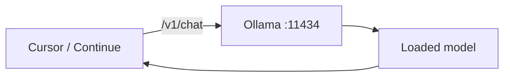

API と IDE の統合

Ollama は **OpenAI 互換** HTTP API を公開するため、IDE とツールはクラウド API ではなくローカル モデルで動作します。



## 1. ベース URL と認証

|設定 |値 |
|----------|----------|
| **ベース URL** |`http://localhost:11434/v1`|
| **API キー** |任意のプレースホルダー (例:`ollama`) — ローカルでは強制されません |
| **モデル名** |正確なタグ:`qwen2.5-coder:7b`|

サーバーは最初のリクエストで起動するか、明示的に実行されます。

```bash
ollama serve
```

## 2.カールでテストする

**チャットの完了:**

```bash
curl http://localhost:11434/v1/chat/completions \
  -H "Content-Type: application/json" \
  -d '{
    "model": "qwen2.5-coder:7b",
    "messages": [
      {"role": "user", "content": "Hello"}
    ]
  }'
```

**ストリーミング:**

```bash
curl http://localhost:11434/v1/chat/completions \
  -H "Content-Type: application/json" \
  -d '{
    "model": "qwen2.5-coder:7b",
    "messages": [{"role": "user", "content": "Count to 5"}],
    "stream": true
  }'
```

**埋め込み:**

```bash
curl http://localhost:11434/v1/embeddings \
  -H "Content-Type: application/json" \
  -d '{
    "model": "nomic-embed-text",
    "input": "Hello world"
  }'
```

## 3. Cursor

1.プルモデル:`ollama pull qwen2.5-coder:7b`2. Cursor 設定 → **モデル** → **OpenAI 互換** プロバイダーを追加します (表現はバージョンによって異なります)。
   - ベース URL:`http://localhost:11434/v1`- API キー:`ollama`- モデル：`qwen2.5-coder:7b`3. チャットまたはエージェント モードでそのモデルを選択します。

Ollama は Cursor と **同じマシン** 上で実行されている必要があります (またはリモートに SSH トンネルを使用します)。

## 4. 続行 (VS コード / JetBrains)

で`config.json`:

```json
{
  "models": [
    {
      "title": "Qwen Coder 7B",
      "provider": "ollama",
      "model": "qwen2.5-coder:7b"
    }
  ]
}
```

続行すると、拡張機能がインストールされているときにローカル Ollama が検出され、`ollama`PATH にあります。

## 5. 環境変数

|変数 |効果 |
|----------|----------|
|`OLLAMA_HOST`|バインドアドレス (デフォルト`127.0.0.1:11434`) |
|`OLLAMA_KEEP_ALIVE`|モデルがロードされたままになる時間 (例:`30m`、`0`= すぐにアンロード) |
|`OLLAMA_NUM_GPU`| GPU 層の数を強制します。`0`= CPU のみ |
|`OLLAMA_MODELS`|カスタム モデル ディレクトリ |

例 — LAN でリッスンします (信頼できるネットワークでのみ使用します):

```bash
OLLAMA_HOST=0.0.0.0:11434 ollama serve
```

## 6. セキュリティ

|リスク |緩和 |
|------|-----------|
| LAN/インターネットでポートを開く |保つ`127.0.0.1`リモート アクセスを意図しない限り |
| API 認証がありません |暴露しないでください`:11434`公共のインターネットへ |
|機密性の高いプロンプト |ローカルのみ — データはマシン上に残ります。まだログを認識します |

＃＃ 次

[モデルファイルとカスタム GGUF](vi-modelfile-and-custom-gguf.md) - ライブラリにないモデルをインポートします。
