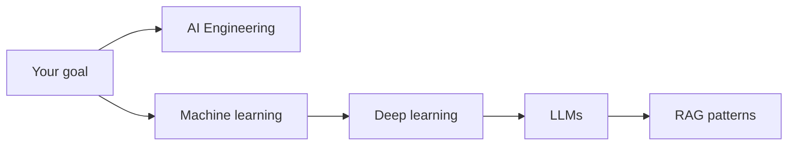
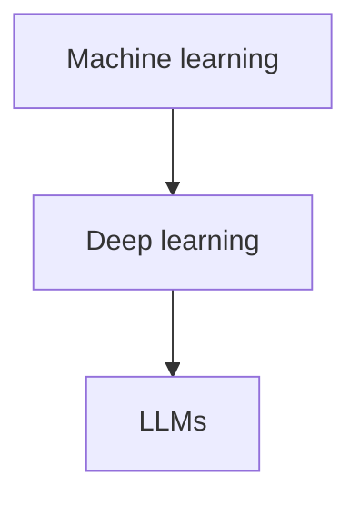

---
label: "I"
subtitle: "概要"
group: "Artificial intelligence"
order: 1
---
AI101 — overview
**Artificial intelligence** in this track covers **using AI in daily work**, **machine learning**, **deep learning**, and **LLMs** — from practical prompting through how models work.

## Map of AI101

| Submenu | Focus | Audience |
|---------|--------|----------|
| [**AI Applied**](ai-engineering/i-overview.md) | Prompting, agents, tools, skills, custom assistants, trust | **Everyone who uses ChatGPT, Claude, Cursor, Copilot** |
| [Machine learning](machine-learning/i-overview.md) | Supervised/unsupervised, evaluation, features | Builders & curious readers |
| [Deep learning](deep-learning/i-overview.md) | Neural nets, CNNs, RNNs, transformers | Technical depth |
| [LLMs](llms/i-overview.md) | Pre-training, alignment, RAG, fine-tuning | Engineers integrating LLMs |

## Which path to take

| You want to… | Start here |
|--------------|------------|
| Write better prompts, use agents, stay safe | [AI Applied overview](ai-engineering/i-overview.md) |
| Learn sklearn, metrics, workflows | [Machine learning overview](machine-learning/i-overview.md) |
| Understand transformers and GPT | [Deep learning](deep-learning/i-overview.md) → [LLMs](llms/i-overview.md) |

## Study order (technical track)

Use **AI Applied** in parallel or first if you mainly interact with products, not train models.

## How this relates to other tracks

| Track | Overlap |
|-------|---------|
| [Python](../../swe101/python/i-basics-and-syntax.md) | pandas, scikit-learn, PyTorch |
| [System design](../../swe101/sysdesign/i-core-building-blocks.md) | Serving models, RAG, search indexes |
| [CS101 data structures](../../cs101/data-structures/i-array.md) | Vectors, matrices intuition |

**Related:** [Skills & agent instructions](ai-engineering/skills-and-agent-instructions/i-overview.md), [Effective prompting](ai-engineering/effective-prompting/i-overview.md), [Agents & agentic workflows](ai-engineering/agents-and-agentic-workflows/i-overview.md).
