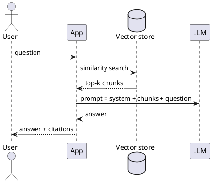

---
label: "V"
subtitle: "RAG とファインチューニング"
group: "LLMs"
order: 5
---
RAG and fine-tuning
Two ways to add **domain knowledge** and **behaviour** without full pre-training from scratch.

## 1. RAG — Retrieval-Augmented Generation

```text
1. Embed documents → vector store (pgvector, Pinecone, OpenSearch k-NN)
2. User question → embed query → nearest-neighbour search
3. Inject top-k chunks into prompt as context
4. LLM generates answer grounded in chunks
```



| Pros | Cons |
|------|------|
| Update knowledge by changing index | Quality = retrieval quality |
| Citations natural | Extra latency (retrieve + longer prompt) |
| No full retrain | Chunking strategy matters |

**Chunking:** 256–512 tokens with overlap; metadata (title, section) in embedding text.

Same pattern as [Order search CDC](../../swe101/sysdesign/examples/viii-order-search-cdc.md) — OLTP vs search index.

## 2. Fine-tuning

Continue training (or adapter training) on domain **(instruction, response)** pairs.

| Method | Detail |
|--------|--------|
| **Full fine-tune** | Update all weights — expensive; forgetting risk |
| **LoRA** | Low-rank adapters on attention layers — train &lt;1% params |
| **QLoRA** | LoRA + quantised base — consumer GPU friendly |

| Pros | Cons |
|------|------|
| Style and format baked in | Needs curated dataset |
| No retrieval step at inference | Knowledge frozen at train time |
| Smaller deployable adapters | Catastrophic forgetting if overdone |

## 3. When to use which

| Need | RAG | Fine-tune / LoRA |
|------|-----|------------------|
| Changing docs (policies, manuals) | **Yes** | Poor alone |
| Fixed tone / JSON format | Optional | **Yes** |
| Long private corpus | **Yes** | Costly to embed all in weights |
| Low latency, no vector DB | No | **Maybe** |

**Production:** **both** — LoRA for format + RAG for facts.

## 4. Evaluation

| RAG metric | Measure |
|------------|---------|
| **Retrieval recall@k** | Correct chunk in top k? |
| **Answer faithfulness** | Supported by retrieved text? |
| **End-to-end** | Human or LLM-as-judge on task |

## 5. Rehearsal questions

- Why RAG does not fix a model that ignores context?
- LoRA vs full fine-tune — parameter and ops trade-off?
- How do citations help trust in enterprise RAG?

**Related:** [Prompt engineering](iv-prompt-engineering.md), [Safety & production](vi-safety-and-production.md).
