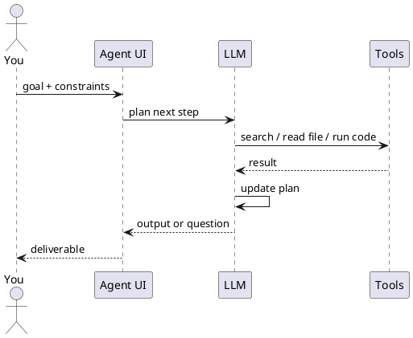

---
label: "III"
subtitle: "Agents & agentic workflows"
group: "Using AI"
order: 3
---
Agents and agentic workflows
An **AI agent** (in products you use) is a model that ** pursues a goal over multiple steps** — planning, calling **tools** (search, code, files, APIs), and adjusting when something fails — instead of answering in one shot.

You do not deploy agents yourself; you **direct** them in Cursor, ChatGPT, Claude, Copilot, and automation platforms.

## 1. Chat vs assistant vs agent

| Mode | You give | AI does |
|------|----------|---------|
| **Chat** | Question | Single reply |
| **Assistant** | Question + saved docs/instructions | Reply grounded in your knowledge |
| **Agent** | **Goal** | Plan → act → observe → repeat until done or blocked |

```text
Goal: "Find last quarter's churn drivers from these CSVs and slide outline"

Agent loop:
  1. Inspect files
  2. Run analysis / search
  3. Draft outline
  4. Ask you one clarifying question OR deliver
```

## 2. What “agentic orchestration” means for users

**Orchestration** = coordinating **steps and tools** to complete a workflow.

| Layer | User-facing example |
|-------|---------------------|
| **Single agent** | Cursor Agent: edit repo from a task description |
| **Tool use** | ChatGPT with browsing + Python + your Google Drive |
| **Multi-agent** (product-managed) | Research mode that searches, reads, synthesises |
| **External orchestration** | Zapier/Make: trigger → AI step → post to Slack |

You design **goals and guardrails**; the product runs the loop.



## 3. When agents help vs hurt

| Good for agents | Better as plain chat |
|-----------------|----------------------|
| Multi-file coding tasks | One-off definition |
| Research across many sources | Short rewrite |
| Repetitive ops with checks | Sensitive irreversible actions without review |
| “Figure out how this repo works” | Factual lookup you can verify in one doc |

| Risk | Mitigation |
|------|------------|
| Wrong file edited | Small tasks; review diffs |
| Invented citations | Require links; verify |
| Runaway scope | “Stop after step 3 and show plan” |
| Cost / time | Set limits; use smaller model for drafts |

## 4. How to direct an agent well

Use the same building blocks as [Effective prompting](ii-effective-prompting.md), plus:

| Add | Example |
|-----|---------|
| **Clear done state** | “Done when: PR-ready diff + test command output.” |
| **Boundaries** | “Do not change files under `/legacy`.” |
| **Tools allowed** | “Use repo search only; no web.” |
| **Checkpoints** | “After plan, wait for my OK before edits.” |
| **Verification** | “Run tests and paste summary.” |

**Cursor / IDE agents:** point at folders, mention stack, reference existing patterns (“match `UserService` style”).

**Research agents:** specify date range, preferred sources, and output schema (table, memo, slides).

## 5. Agentic patterns in products (2025–2026)

| Product area | Agent-like behaviour |
|--------------|----------------------|
| **Cursor Agent** | Multi-file code changes, terminal, browser |
| **ChatGPT** | Agent mode, deep research, connectors |
| **Claude** | Projects + tool use, computer use (where enabled) |
| **Microsoft Copilot** | M365 graph + actions in tenant |
| **Devin / coding agents** | Long-horizon software tasks (human review critical) |

Capabilities change quickly — principles stay: **goal, constraints, verify**.

## 6. Human-in-the-loop

Treat agent output as **draft**:

```text
Plan → approve → execute → review → ship
```

For legal, medical, financial, or production deploys: **you** are accountable; the agent is a fast intern.

## 7. Rehearsal questions

- How is an agent different from a long chat thread?
- Name two guardrails before letting an agent edit code.
- What is orchestration in one sentence for a non-developer?

**Related:** [Tools & orchestration](iv-tools-and-orchestration.md), [Skills & agent instructions](viii-skills-and-agent-instructions.md), [Trust & verify](vii-trust-privacy-and-verify.md).
