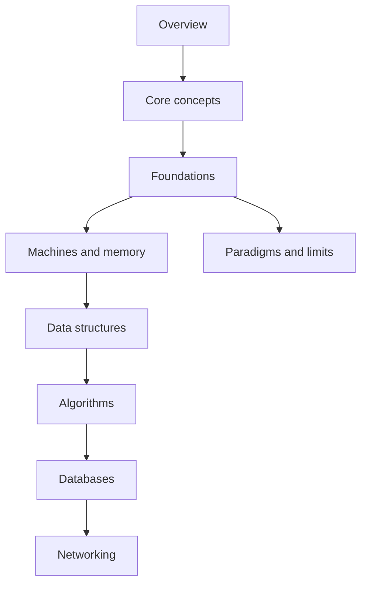

CS101 — 概要

**コンピュータサイエンスの基礎**をエンジニア向けにまとめたトラックです。マシンの仕組み、主要なデータ構造とアルゴリズム、ストレージとしてのデータベース、ネットワーク上のバイトの流れを扱います。API の背後にある *なぜ* を押さえたいときは、**SWE101** の前後どちらでも使えます。

## CS101 の地図

| 領域 | 焦点 |
|------|--------|
| [**コア概念**](i-core-concepts.md) | どこにでも出てくる大きな考え方 |
| [**基礎**](ii-foundations.md) | 語彙とメンタルモデルの土台 |
| [**マシンとメモリ**](i-machines-and-memory.md) | OS の役割、メモリ、実行 |
| [**パラダイムと限界**](iv-paradigms-and-limits.md) | 計算モデルとできないこと |
| [**データ構造**](data-structures/i-array.md) | 配列、リスト、木、ヒープ、グラフ、ハッシュテーブル |
| [**アルゴリズム**](Algorithms/i-overview.md) | ソート、探索、グラフ、DP、貪欲、バックトラッキング |
| [**データベース**](databases/i-overview.md) | リレーショナル、KV、ドキュメント、ワイドカラム、グラフ、時系列 |
| [**ネットワーキング**](networking/i-tcp-udp-and-transport-basics.md) | TCP/UDP、HTTP、TLS、DNS、L4/L7、リアルタイム |

## おすすめの順番

## 他トラックとの関係

| トラック | 重なり |
|-------|---------|
| [SWE101](../swe101/i-overview.md) | これらの考えを *使う* 言語・フレームワーク・システム設計 |
| [SRE101](../sre101/i-overview.md) | ネットワーキングの上に載る LB、DNS、オブザーバビリティ |
| [Cybersecurity](../cybersecurity/i-overview.md) | TLS、アイデンティティ、ネットワーク制御 |
