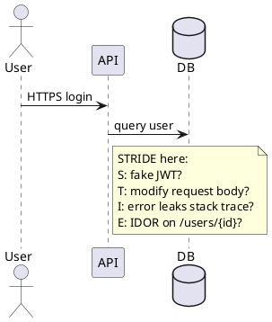

脅威モデリングとリスク
セキュリティツールを買い揃える前に、**何を守るか**、**誰から守るか**、**失敗したらどうなるか**を答えます。脅威モデリングはそれを明示します。

## 1. 資産から始める

| 資産の種類 | 例 | 通常インパクトが大きいもの |
|------------|----------|------------------------|
| **データ** | PII、決済カード、資格情報、ソースコード | 規制対象・金銭価値のあるデータ |
| **システム** | 本番 API、管理コンソール、CI ランナー | データやデプロイへの経路 |
| **アイデンティティ** | 管理者アカウント、API キー、OAuth クライアント | 王国の鍵 |
| **評判** | ブランド、顧客信頼 | 公開インシデント後 |

**クラウンジュエル（最重要資産）:** 侵害が会社存続や法的破綻につながる少数の対象。まずここにコントロールをマップします。

## 2. 攻撃対象領域（Attack surface）

攻撃者が**内部に入る前に到達できる**すべてのもの:

```text
Internet-facing API
  → admin UI on same domain?
  → debug endpoint in prod?
  → S3 bucket with list permission?
  → Jenkins with old plugin?
  → employee laptop with VPN + prod DB creds?
```

| 対象 | 縮小方法 |
|---------|----------------|
| 開いているポート | 未使用を閉じる。セキュリティグループ / NSG |
| 公開リポジトリ | シークレットなし。社内コードは private |
| サードパーティ SaaS | SSO、SCIM、監査ログ |
| サプライチェーン | 依存固定、SBOM、署名イメージ（[SRE サプライチェーン](../sre101/cicd/security-and-best-practices/ii-supply-chain-and-slsa.md)） |

## 3. STRIDE（コンポーネント単位）

脅威カテゴリの古典的な記憶術 — 各**データフロー**または**コンポーネント**を歩きます。

| 文字 | 脅威 | 問い |
|--------|--------|----------|
| **S** | Spoofing（なりすまし） | 他ユーザー・サービスになりすませるか？ |
| **T** | Tampering（改ざん） | 転送中・保存中のデータやコードを変えられるか？ |
| **R** | Repudiation（否認） | 信頼できる監査証跡なしに操作できるか？ |
| **I** | Information disclosure（情報漏洩） | シークレットや PII が漏れるか？ |
| **D** | Denial of service（サービス拒否） | 安価に可用性を潰せるか？ |
| **E** | Elevation of privilege（権限昇格） | 低権限ユーザーが admin になれるか？ |



## 4. 軽量脅威モデルワークショップ（60 分）

| ステップ | 活動 |
|------|----------|
| 1 | **システム図**を描く（箱と矢印、信頼境界） |
| 2 | **資産**と**エントリポイント**を列挙 |
| 3 | 境界をまたぐたびに STRIDE |
| 4 | **発生可能性 × 影響**を評価（1〜3 の単純スケール） |
| 5 | 上位 5 件の緩和策を選び、担当を割り当て |

成果物は生きた文書 — リージョン追加、認証プロバイダ変更、ツール付き AI 機能などアーキテクチャの大きな変更のたびに見直します。

## 5. リスク = 発生可能性 × 影響

| | 影響小 | 影響大 |
|---|------------|-------------|
| **起きやすい** | 早めに修正 | **出荷停止** |
| **起きにくい** | バックログ | 緩和を計画 |

**影響**の例:

| 事象 | 影響 |
|-------|--------|
| マーケティングサイトの公開読み取り | 低 |
| 本番 DB の暗号化・身代金要求 | 致命的 |
| 1 万件のメール漏洩 | 高（法的 + 信頼） |

**発生可能性**の要因: 露出（インターネット向き）、攻撃者の関心、コントロールの成熟度。

ISO 27005、NIST RMF などの正式フレームワークもありますが、スタートアップはしばしば**単純なマトリクス**から始め、徐々に洗練します。

## 6. 信頼境界（Trust boundaries）

**信頼境界**は、データや制御が**信頼度の低い**ゾーンから**高い**ゾーンへ越える地点です。

| 境界 | 越えるときに検証すること |
|----------|----------------------|
| ブラウザ → API | 認証、入力検証、レート制限 |
| API → 内部サービス | mTLS または署名付きサービス ID |
| CI ランナー → クラウド | OIDC、スコープ付き IAM（[シークレットと OIDC](../sre101/cicd/security-and-best-practices/iii-secrets-and-oidc.md)） |
| ベンダー SaaS → 自社データ | DPA、暗号化、アクセスレビュー |

## 7. よくある誤り

| 誤り | より良いアプローチ |
|---------|-----------------|
| リリース後だけ脅威モデル | 設計時にスケッチ。エピックごとに更新 |
| 「HTTPS だから大丈夫」 | アプリ層のバグ（IDOR、インジェクション）は残る |
| VPN 内ユーザーをすべて信頼 | ゼロトラスト — 毎リクエスト検証（[次のノート](iv-application-and-network-security.md)） |
| インサイダーを無視 | 最小権限、ログ、職務分離 |
| チェックリストコンプライアンスのみ | *自社システム*の実脅威にコントロールを結びつける |

## 8. リハーサル問題

- 資産と攻撃対象領域の違いは？ 各 1 例。
- STRIDE の 6 カテゴリをすべて挙げよ。
- 図に信頼境界を描く理由は？
- 「起きにくいが壊滅的」なリスクを早めに緩和するのはいつ？

**関連:** [概要](i-overview.md)、[アイデンティティとシークレット](iii-identity-access-and-secrets.md)、[アプリとネットワーク](iv-application-and-network-security.md)。
