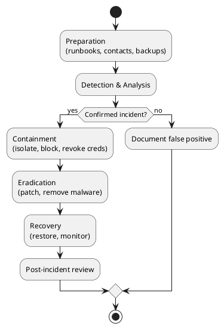

インシデント対応と運用
防御はいつか破られます。**検知**、**準備された対応**、**インシデントからの学習**が被害と復旧時間を抑えます。

## 1. セキュリティ運用ループ

```text
Prevent → Detect → Respond → Recover → Learn → (improve Prevent)
```

| フェーズ | 担当 | 成果物 |
|-------|-------|--------|
| **防止（Prevent）** | 開発 + セキュリティ | ハードニング、教育、パッチ |
| **検知（Detect）** | SRE + セキュリティ | アラート、SIEM ルール、異常レポート |
| **対応（Respond）** | IR チーム + オンコール | 封じ込め、根絶 |
| **復旧（Recover）** | 開発 + SRE | サービス復元、完全性の検証 |
| **学習（Learn）** | 全員 | 事後レビュー、チケット化された修正 |

可観測性スタック: [Prometheus](../sre101/tooling/prometheus/i-intro-and-architecture.md) — セキュリティは同じログとメトリクスを、別のクエリと手順書で使います。

## 2. 何をログに残すか（セキュリティ関連）

| イベント | 記録するフィールド |
|-------|-------------------|
| **認証** | user/service id、成功/失敗、IP、user-agent（PII に注意） |
| **認可拒否** | リソース、アクション、主体 |
| **管理者操作** | IAM、ファイアウォール、課金を誰が変更したか |
| **データエクスポート** | 大量ダウンロード、一括 API 読み取り |
| **デプロイ / 設定** | イメージダイジェスト、本番承認者 |

| 良い | 悪い |
|------|-----|
| 構造化 JSON ログ | 検索不能な printf 文字列 |
| 集約保持（90 日〜1 年+） | 1 Pod だけにログ |
| サービス横断の相関 ID | 時刻同期なし（NTP を使う） |

**ログに出さない:** パスワード、決済 PAN 全文、生のセッショントークン。

## 3. 検知ソース

| ソース | 検知例 |
|--------|---------|
| **SIEM / ログアラート** | ブルートフォース、不可能な移動ログイン |
| **IDS/IPS / WAF** | 既知の攻撃シグネチャ |
| **エンドポイント EDR** | マルウェア、資格情報ダンプ |
| **CloudTrail / 監査ログ** | IAM 変更、公開バケット ACL |
| **依存関係 / シークレットスキャナ** | PR で導入された CVE |
| **ユーザー報告** | フィッシング、アカウント乗っ取り |

アラートは**実行可能**に調整 — アラート疲れは本当のインシデントの見逃しにつながります。

## 4. インシデント対応フェーズ（NIST 風）



| フェーズ | アクション |
|-------|---------|
| **準備** | IR 名簿、連絡テンプレート、法務連絡先、テスト済みバックアップ |
| **検知** | 重大度トリアージ（P1 データ侵害 vs P3 スキャンノイズ） |
| **封じ込め** | 侵害アカウント無効化、IP ブロック、消去**前**にディスクスナップショット |
| **根絶** | 脆弱性パッチ、露出の可能性がある**すべて**のシークレットをローテーション |
| **復旧** | 段階的復元。再侵入を監視 |
| **教訓** | 5 営業日以内の非難のないレビュー |

## 5. 重大度ガイド（例）

| Sev | 基準 | 例 |
|-----|----------|---------|
| **P1** | 進行中の持ち出し、本番ランサム、全面停止 | 顧客 DB 流出 |
| **P2** | 限定的な侵害確認、重大脆弱性の悪用 | 単一 admin アカウント乗っ取り |
| **P3** | 疑わしい活動、封じ込め済みの試行 | ブロックされたブルートフォース急増 |
| **P4** | ポリシー違反、低リスク | 社外へのドキュメント共有 |

**誰をページするか**はインシデント中ではなく、事前に重大度ごとに定義します。

## 6. コミュニケーション

| 対象 | タイミング | メッセージの型 |
|----------|------|----------------|
| **社内ウォールーム** | 即時 | 事実、タイムライン、担当 |
| **経営** | P1/P2 | 影響、ETA、規制上の露出 |
| **顧客** | データ影響が確定 | 明確、専門用語少なめ、対処法 |
| **規制当局** | 法的に必要な場合 | 法務判断（GDPR 72 時間など） |

調査終了前に**根本原因を公表しない**。**決定は**タイムスタンプ付き共有チャンネルに記録する。

## 7. 卓上演習（90 分）

本番を変えず**架空シナリオ**を歩きます。

```text
Scenario: GitHub token leaked in public gist at 09:00 UTC.
          Attacker cloned private repo; prod k8s creds in old .env.example.
```

| 分 | 活動 |
|--------|----------|
| 0–15 | シナリオ提示。役割割当（指揮、広報、開発、法務） |
| 15–45 | 1 時間目は？ 24 時間目は？ |
| 45–60 | ギャップ一覧: 手順書なし、ローテーションリストなし |
| 60–90 | 改善 3 件を優先順位付け、担当を割り当て |

**四半期ごと**に実施。シナリオをローテーション（ランサム、インサイダー、サプライヤー侵害、DDoS）。

## 8. パッチと脆弱性管理

| 頻度 | 範囲 |
|---------|-------|
| **Critical CVE** | インターネット向きで野外悪用中なら数時間〜数日 |
| **High** | 今スプリント |
| **Medium/Low** | バックログ + エッジケースはリスク受容 |

| プロセス | 詳細 |
|---------|--------|
| **インベントリ** | 何を動かしているか把握（SBOM が役立つ） |
| **スキャン** | OS、コンテナ、依存関係 |
| **テスト** | 本番再起動前にステージング |
| **緊急** | 事前承認のブレークグラスデプロイ経路 |

## 9. バックアップと復旧（セキュリティ視点）

バックアップは**ランサムウェア**復旧経路 — 攻撃者が本番を暗号化したら**不変**バックアップから復元します。

| 要件 | 理由 |
|-------------|-----|
| **オフラインまたは不変コピー** | 攻撃者がバックアップも暗号化できない |
| **テスト済み復元** | 一度も復元していないバックアップは未知数 |
| **RPO/RTO** | 許容するデータ損失とダウンタイム |

## 10. インシデント後

| 成果物 | 内容 |
|----------|---------|
| **タイムライン** | UTC タイムスタンプ、証拠リンク |
| **根本原因** | 技術 + プロセスの失敗 |
| **うまくいったこと** | 検知、連絡、ロールバック |
| **アクション項目** | 担当・期限付きチケット |
| **非難なし** | システムとインセンティブに焦点 |

アクションを[脅威モデル](ii-threat-modeling-and-risk.md)と[CI/CD ゲート](../sre101/cicd/security-and-best-practices/vii-release-gates-and-rollbacks.md)にフィードバックします。

## 11. リハーサル問題

- 検知後の IR フェーズを 5 つ挙げよ。
- 根絶前にディスクをスナップショットする理由は？
- ログイン失敗のセキュリティログ行に何を含めるか？
- 監視があるのに卓上演習をする理由は？

**関連:** [概要](i-overview.md)、[アプリとネットワーク](iv-application-and-network-security.md)、[パイプライン可観測性](../sre101/cicd/security-and-best-practices/vi-pipeline-observability-and-dora.md)。
