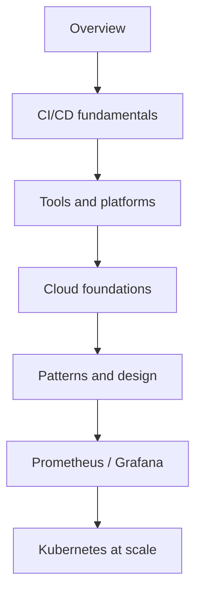

SRE101 — 概要

**サイト信頼性 / プラットフォームエンジニアリング**のノートです。ソフトウェアをビルドし、出荷し、本番で生かし続ける方法 — CI/CD、クラウドアーキテクチャ、オブザーバビリティのツール群 — を扱います。

アプリを書ける前提で、このトラックは **デリバリーと運用** に焦点を当てます。

## SRE101 の地図

| サブメニュー | 焦点 |
|---------|--------|
| [**CI/CD**](cicd/i-fundamentals.md) | パイプライン、Terraform、Ansible/Jenkins、セキュリティゲート |
| [**クラウドアーキテクチャ**](cloud-architecture/foundations/i-overview.md) | クラウドの基礎、パターンと設計 |
| [**ツーリング**](tooling/prometheus/i-intro-and-architecture.md) | Prometheus、Grafana、Alertmanager、Loki、Kubernetes、Terraform |

## CI/CD

| 領域 | 焦点 |
|------|--------|
| [基礎](cicd/i-fundamentals.md) | CI/CD とは何か、なぜ重要か |
| [ツールとプラットフォーム](cicd/tools-and-platforms/i-overview.md) | GitHub Actions、GitLab CI、Jenkins など |
| [Terraform](cicd/terraform/i-overview.md) | パイプライン内のインフラ as code |
| [Ansible & Jenkins](cicd/ansible-and-jenkins/i-overview.md) | 構成管理とクラシック CI |
| [セキュリティとベストプラクティス](cicd/security-and-best-practices/i-overview.md) | サプライチェーン、シークレット、OIDC、ゲート |

## クラウドアーキテクチャ

| 領域 | 焦点 |
|------|--------|
| [基礎](cloud-architecture/foundations/i-overview.md) | リージョン、コンピュート、ストレージ、ネットワーキング |
| [パターンと設計](cloud-architecture/patterns-and-design/i-overview.md) | スケーラビリティ、マイクロサービス、オブザーバビリティ、コスト |

## ツーリング

| 領域 | 焦点 |
|------|--------|
| [Prometheus](tooling/prometheus/i-intro-and-architecture.md) | メトリクスと PromQL |
| [Grafana](tooling/grafana/i-intro.md) | ダッシュボード |
| [Alertmanager](tooling/alertmanager/i-intro.md) | アラートのルーティング |
| [Loki](tooling/iv-loki.md) | ログ集約 |
| [Kubernetes](tooling/kubernetes/i-intro-and-architecture.md) | ワークロードと運用 |
| [Terraform](tooling/terraform/i-intro-and-architecture.md) | CLI ワークフローと state |

## おすすめの順番

## 他トラックとの関係

| トラック | 重なり |
|-------|---------|
| [SWE101](../swe101/i-overview.md) | デプロイするアプリと API |
| [CS101 ネットワーキング](../CS101/networking/i-tcp-udp-and-transport-basics.md) | クラウド LB の下にある L4/L7、DNS、TLS |
| [Cybersecurity](../cybersecurity/i-overview.md) | アイデンティティ、シークレット、インシデント対応 |
