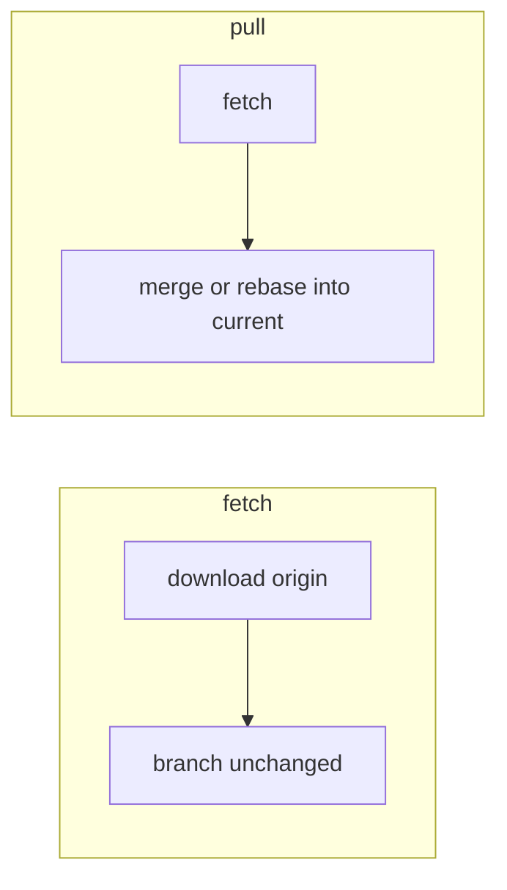
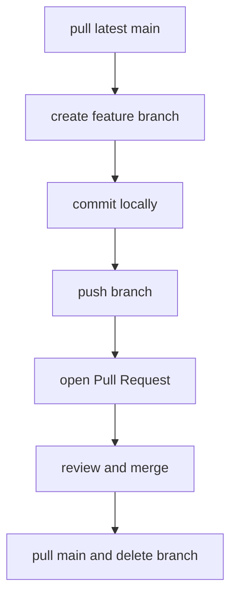

リモートとコラボレーション


A **remote** is a named URL to another repository — usually **`origin`** on GitHub. **Fetch** downloads; **pull** fetches + integrates; **push** uploads your commits.

## 1. リモートコマンド

```bash
git remote -v
git remote add origin git@github.com:you/app.git
git remote set-url origin git@github.com:you/app.git

git fetch origin              # download branches/tags — no merge
git pull origin main          # fetch + merge into current branch
git push origin main          # upload commits
git push -u origin feature/x  # first push — set upstream
```

After `-u`, plain **`git push`** / **`git pull`** use the tracking branch.

## 2. フェッチとプル



共有ブランチのより安全なワークフロー:

```bash
git fetch origin
git log HEAD..origin/main --oneline   # what's new upstream?
git merge origin/main                 # or rebase
```

## 3. リベースでプルする

プッシュする前に機能ブランチを線形に保ちます。

```bash
git config --global pull.rebase true
# or per pull:
git pull --rebase origin main
```

PR を開く前の機能ブランチ:

```bash
git switch feature/api
git fetch origin
git rebase origin/main
git push --force-with-lease
```

**`--force-with-lease`** — safer than `--force`; fails if remote moved unexpectedly.

## 4. ブランチの追跡

```bash
git branch -vv
# feature/api  abc1234 [origin/feature/api] latest commit msg
```

欠落している場合は上流に設定します。

```bash
git push -u origin feature/api
```

## 5. コラボレーションの流れ



PR UI、レビュー、ブランチ保護については、**GitHub** トピックを参照してください。

## 6. フォークのワークフロー

他の人のリポジトリに貢献する:

```bash
# clone your fork
git clone git@github.com:you/upstream-project.git
cd upstream-project
git remote add upstream git@github.com:original/upstream-project.git

git fetch upstream
git switch main
git merge upstream/main
git push origin main
```

PR は **フォークから** → **上流**に進みます。

## 7. タグとリリース

```bash
git tag v1.0.0
git tag -a v1.0.0 -m "Release 1.0.0"
git push origin v1.0.0
git push origin --tags
```

GitHub **リリース** は、バイナリとメモをタグに添付します。

## 8. プッシュのトラブルシューティング

| Error | Fix |
|-------|-----|
| `rejected (non-fast-forward)` | Pull/rebase first, then push |
| `permission denied` | SSH key or token |
| `protected branch` | Use PR; cannot push directly to `main` |

**Related:** [Branching & merging](iv-branching-and-merging.md), CI/CD (workflows on `push`).
