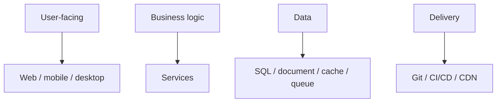
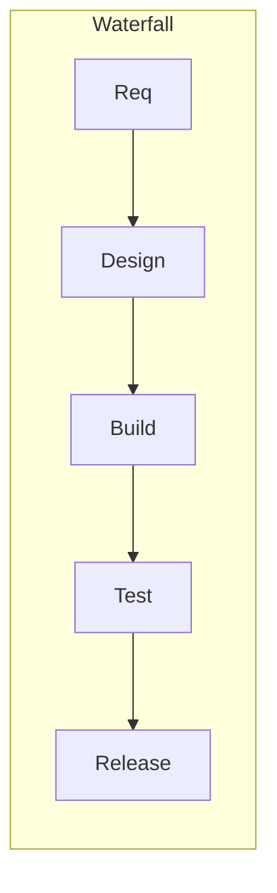
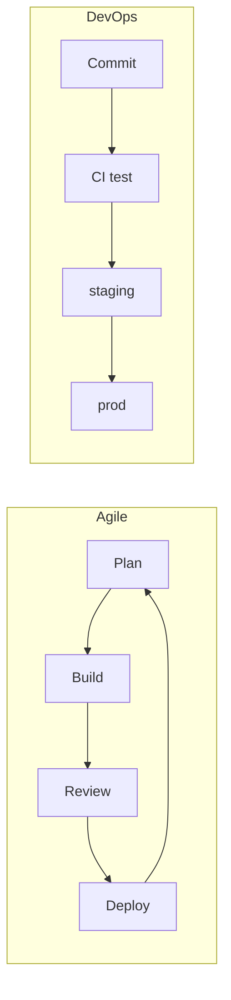

SWE101 — 概要

**ソフトウェアエンジニアリング**は、問題を信頼性高く解くシステムを作り運用することです — コードを書くだけではありません。このカリキュラムは言語、**フレームワーク**、データベース、デリバリーツール、設計パターンを扱います。**どんな種類のソフトウェアがあるか**、**チームがどう出荷するか**から始め、スタックに合うサブメニューへ進んでください。

## SWE101 の地図

| 領域 | このトラック内の例 |
|------|-------------------------|
| **バージョン管理** | [Git](git/i-overview.md) |
| **言語** | [Java](languages&frameworks/java/intro/i-basics-and-syntax.md), [Python](languages&frameworks/python/i-basics-and-syntax.md), [Rust](languages&frameworks/rust/i-basics-and-toolchain.md) |
| **フレームワーク** | [Spring Boot](languages&frameworks/java/springboot/i-intro-and-project-layout.md), [HTMX](languages&frameworks/htmx/i-overview.md) |
| **バックエンドとデータ** | [Postgres](postgres/i-overview.md), [MongoDB](mongodb/i-overview.md), [Redis](redis/i-overview.md), [PL/SQL](plsql/i-overview.md) |
| **インフラとデリバリー** | [CDN](cdn/i-overview.md), [API gateway](api-gateway/i-overview.md) |
| **設計** | [システム設計](sysdesign/scalable-patterns/i-overview.md), [PlantUML](languages&frameworks/plantuml/i-overview.md) |

## 1. ソフトウェアの種類

ソフトウェアは **誰が使うか**、**どこで動くか**、**どう売るか** で分類できます。スキルは共通で、制約が違います。

| 種類 | 実行場所 | 典型例 | よく使う枠組み | 主な制約 |
|------|---------|------------------|-------------------|-----------------|
| **Web アプリケーション** | ブラウザ + サーバ | SaaS、EC、管理画面 | Spring Boot、HTMX、React 系 | レイテンシ、認証、SEO、レスポンシブ |
| **モバイルアプリ** | スマホ/タブレット | 銀行、ソーシャル、現場業務 | React Native、Flutter など | ストア規約、オフライン、プッシュ |
| **デスクトップ** | Windows / macOS / Linux | IDE、制作ツール、POS | Electron、.NET、Qt、Tauri | インストーラ、自動更新、ローカルファイル |
| **API / バックエンド** | サーバ、コンテナ | REST/GraphQL、webhook | Spring Boot、FastAPI、Express など | 可用性、スケール、バージョニング、冪等性 |
| **組み込み / ファームウェア** | MCU、デバイス | 家電、センサー、車載 | FreeRTOS、Zephyr など | メモリ制限、リアルタイム、安全 |
| **CLI / 開発者ツール** | ターミナル、CI | `git`、ビルド、リンタ | Click、Cobra、Clap ([Rust](languages&frameworks/rust/i-basics-and-toolchain.md)) | スクリプト性、クロスプラットフォーム |
| **バッチ / データパイプライン** | スケジューラ、Spark など | ETL、レポート、学習ジョブ | Spark、Airflow、dbt | スループット、コスト、正しさ |
| **社内ツール** | 社内ネットワーク | サポート画面、運用ダッシュボード | Web と同じく React + Spring / HTMX など | SSO、監査ログ |
| **プラットフォーム / インフラ** | クラウド、k8s | DB、キュー、CDN | Kubernetes、Terraform（**SRE101** 参照） | 信頼性、マルチテナント分離 |

多くのプロダクトは組み合わせです。**モバイル**が **バックエンド API** を呼び、裏に **Postgres**、運用者向けに **Web 管理画面** がある、など。

## 2. デプロイと所有モデル

| モデル | 意味 | 気にすること |
|-------|---------|----------------|
| **SaaS** | ベンダーがホスト | マルチテナント、アップグレード、SLA |
| **オンプレミス** | 顧客データセンターで稼働 | インストール手順、エアギャップ更新 |
| **オープンソース** | ソース公開、サポートは任意 | ライセンス、コミュニティ、セキュリティ修正 |
| **ライセンス販売** | インストール型 + ライセンスキー（今日は稀） | 更新、互換性 |
| **内製** | 1 組織向け | レガシー連携 |

## 3. 開発ライフサイクルの種類

**ライフサイクル**は、アイデアから稼働ソフトウェアへの進め方です。チームは混ぜて使います。

| ライフサイクル | 流れ | 向いているとき | トレードオフ |
|-----------|------|-----------|-----------|
| **ウォーターフォール** | 要件 → 設計 → 実装 → テスト → デプロイ（逐次） | 固定スコープ、契約、規制文書 | フィードバックが遅い |
| **アジャイル（総称）** | 短い反復、動くソフトウェア、変化を歓迎 | 多くのプロダクト開発 | 規律が必要 |
| **Scrum** | 固定長スプリント、役割とセレモニー | 1 プロダクトの横断チーム | 小チームでは儀式が重いことも |
| **Kanban** | 連続フロー、WIP 制限 | 運用・サポートの定常タスク | 納期予測が弱い |
| **反復 / 増分** | 薄いスライスを早く出し拡張 | MVP、学習重視 | 毎回デプロイ可能な増分が必要 |
| **DevOps / CI/CD** | 変更ごとのビルド・テスト・デプロイ自動化 | 頻繁に出荷するチーム | パイプライン投資が先に必要 |
| **Shape Up** | 6 週サイクル、betting table | プロダクト企業（Basecamp 流） | スプリント型ではない |

## 4. ライフサイクルをまたぐ環境

| 環境 | 目的 |
|-------------|---------|
| **Local** | 開発者マシン — 速いフィードバック |
| **Dev / shared** | ブランチ統合。不安定でも可 |
| **Staging / pre-prod** | 本番相当。QA とデモ |
| **Production** | 実ユーザー — 変更管理と監視 |

コードの昇格: [Git](git/i-overview.md) のブランチとタグがこれらの段階に対応し、パイプライン（**SRE101 / CI/CD**）が道筋を自動化します。

## 5. 出会う役割（短く）

| 役割 | 焦点 |
|------|--------|
| **ソフトウェアエンジニア** | 機能、バグ、設計、テスト |
| **フロント / バック / フルスタック** | UI / サーバ / 両方 |
| **QA / SDET** | テスト計画、自動化 |
| **DevOps / SRE** | デプロイ、監視、インシデント |
| **プロダクトマネージャ** | 優先度、要件 |
| **デザイナー** | UX、ビジュアル |

小さいチームでは役割が混ざり、大きい組織では専門化します。

## 6. このトラックがライフサイクルにどう効くか

| フェーズ | 役立つ SWE101 トピック |
|-------|-------------------------|
| **設計** | [システム設計](sysdesign/scalable-patterns/i-overview.md), [PlantUML](languages&frameworks/plantuml/i-overview.md) |
| **実装** | 言語、[Java Spring Boot](languages&frameworks/java/springboot/i-intro-and-project-layout.md) |
| **データ保存** | [Postgres](postgres/i-overview.md), [MongoDB](mongodb/i-overview.md), [Redis](redis/i-overview.md) |
| **統合と出荷** | [Git](git/i-overview.md), [API gateway](api-gateway/i-overview.md) |
| **スケールと運用** | [CDN](cdn/i-overview.md), システム設計のボトルネック分析 |

クラウドデリバリーと CI/CD の深掘りは **SRE101** を参照してください。

## 次へ

サイドバーからサブメニューを選んでください — [Git essentials](git/essentials/i-overview.md) と言語トラックがよくある開始点です。
