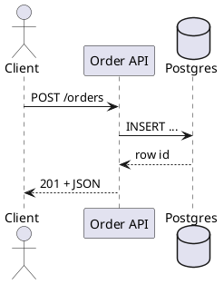
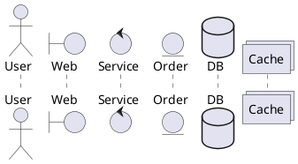
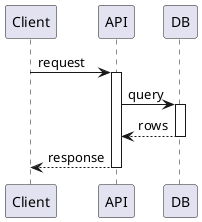
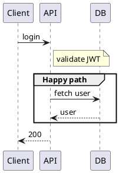
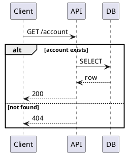
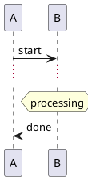
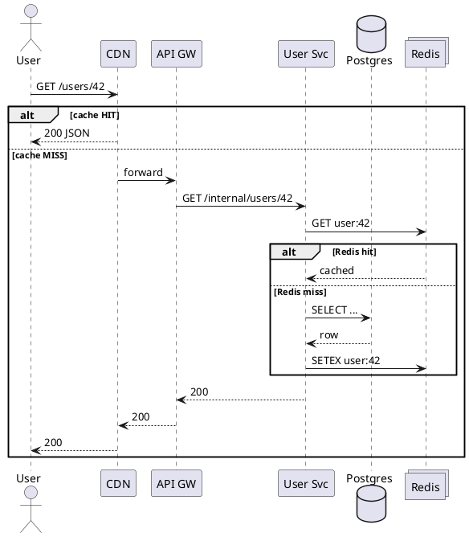
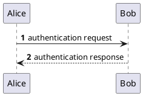

---
label: "III"
subtitle: "シーケンス図"
group: "PlantUML"
order: 3
---
PlantUML — Part III
**Sequence diagrams** show **who talks to whom, in what order** — ideal for HTTP calls, queue handoffs, auth flows, and failure paths. They are the default choice in design docs and incident writeups.

## 1. Basic syntax

| Arrow | Meaning |
|-------|---------|
| **`->`** | Solid line — call / request |
| **`-->`** | Dashed line — return / response |
| **`->>`** | Open arrow — async message (style) |
| **`Client ->> API`** | Same semantics; visual emphasis |

Define participants once; alias with **`as`** for shorter references.

## 2. Participant types

| Keyword | Use |
|---------|-----|
| **`actor`** | Human or external system |
| **`boundary`** | UI, API gateway edge |
| **`control`** | Application / orchestration logic |
| **`entity`** | Domain object or record |
| **`database`** | SQL, document store |
| **`collections`** | Cache, in-memory structure |

Stereotypes and colors: `participant "API" as API <<Service>>` — pair with `skinparam` or shared include files.

## 3. Activation bars

**`activate` / `deactivate`** (or `++` / `--` shorthand on arrows) show when a participant is busy — helpful for nested calls.

## 4. Notes and grouping

| Block | Purpose |
|-------|---------|
| **`note left/right of X`** | Annotate a participant |
| **`note over A, B`** | Span multiple participants |
| **`group` / `end`** | Label a section (non-semantic) |
| **`alt` / `else` / `end`** | Conditional branches |
| **`opt`** | Optional fragment |
| **`loop`** | Repeated steps |
| **`par`** | Parallel fragments |

### `alt` example (error path)

Document **both** happy and unhappy paths — reviewers catch missing error handling early.

## 5. Lifelines, delays, and references

| Feature | Syntax |
|---------|--------|
| **Delay** | `...` on its own line |
| **Hanging note** | `hnote over` |
| **Reference another diagram** | `ref over A, B : see checkout.puml` |
| **Create/destroy** | `create B` / `destroy B` |

## 6. Realistic API + cache flow

Cross-link concepts: [CDN overview](../cdn/i-overview.md), [Redis patterns](../redis/iv-patterns-and-use-cases.md), [API gateway overview](../api-gateway/i-overview.md).

## 7. Style tips

| Tip | Why |
|-----|-----|
| **Left-to-right flow** | `left to right direction` for wide diagrams |
| **Consistent naming** | Match service names in code and Terraform |
| **One scenario per file** | `checkout-happy.puml`, `checkout-payment-fail.puml` |
| **Number steps in prose** | Use `autonumber` for incident timelines |

## Next

Continue with [Component & deployment](iv-component-and-deployment.md) for structural and runtime topology diagrams.
